# Benchmarks — the full picture

Every measured axis of this project, in readable form. Each table states its setup and links
the committed raw output. Methodology details and negative results live in the dated reports
under [`findings/`](findings/); this page is the summary you can actually read.

**Models.** All checkpoints are RWKV-7 (the RWKV7-G1 family). **Unless a table or row says
otherwise, the model is the 1.5B** (`rwkv7-1.5b-fla`, or its prequantized checkpoints for
quant rows). The **0.1B** (`rwkv7-0.1b-fla`) and **7.2B** (`rwkv7-7.2b-fla`) rows are always
labeled with their size. Precision is fp16/bf16 unless a row names a quant tier (w8g64 / w8a8 /
int4-GPTQ / w4).

**Engine versions.** Since 2026-07-05 all new measurements run on **sglang main**; earlier
numbers were measured on v0.5.10 and are kept, marked "(v0.5.10)". Where both exist we show
both — the migration itself changed nothing for correctness (verified) and made the 3090
slightly faster across the board.

**Two timing windows** (do not compare across them):

| | steady-state | wall-clock |
|---|---|---|
| plain meaning | "tokens per second once it's running" | "tokens per second from request sent to answer complete" |
| includes prompt reading (TTFT)? | no | yes |
| tool | `bench/serving_scale.py` | `bench/bsz_throughput.py` (64-in/256-out) |
| used in | §3 single-request ladder, §4 quant | §4b int4 speed, §5 sweeps, §6 fleet, §7 Albatross |

Same config, same GPU: steady-state reads ~3% higher. Every table below says which window it uses.

All comparison tables use **cuda-graph ON** (the production decode path — serving_scale.py,
run_clean_comparison.py, and bsz_throughput.py via serve.sh). A separate script, throughput.py,
reports an **eager (cuda-graph OFF) baseline** used only for internal kernel-development tracking;
its numbers are ~2× lower for batched decode and are never quoted against the cuda-graph tables.

---

## 0. Glossary — every term in plain words / 名词表——每个术语说人话

Every recurring term in this document, three ways: the term itself, what it means technically
(one line), and a plain-words version a non-engineer can follow. Terms elsewhere on this page
link back to their row here on first use. (中文版见
[BENCHMARKS.zh-CN.md](BENCHMARKS.zh-CN.md) 同名一节——说人话列是专为中文读者写的口语版。)

| term | technically | in plain words |
|---|---|---|
| **fp16 / bf16 / fp32** | 16-/32-bit floating-point number formats; bf16 keeps fp32's range with fewer precision bits | How many digits the GPU keeps per number. fp32 is the full-size notebook; fp16/bf16 are half-size: half the memory, often nearly twice the speed, at the cost of rounding earlier. bf16 is the variant that prefers "can hold huge and tiny numbers" over "many exact digits". |
| **int8 / int4** | 8-/4-bit integer storage formats (256 / 16 possible values per number, plus shared scale factors) | Squeezing each stored number into one of 256 (int8) or just 16 (int4) buckets. The model file shrinks 2×/4× vs fp16 — the open question each §4 table answers is what that squeeze costs in accuracy. |
| **quantization** | converting fp16 weights (and sometimes activations) to a lower-bit format like int8/int4 | Shrinking the model by rounding its numbers onto a coarser grid. You pay less VRAM and often gain speed; the price, if any, is accuracy — which is why every quant row here ships with an accuracy measurement next to it. |
| **GPTQ vs RTN** | two int4 weight-rounding algorithms — RTN rounds each weight to the nearest grid point; GPTQ calibrates the rounding on sample text to minimize output error | Two ways of doing the int4 rounding. RTN = round every number independently (simple, needs no data). GPTQ = round while watching what the model actually computes on real text, compensating as it goes (smarter). Same file format, same runtime speed — only the stored values differ, so picking GPTQ over RTN is a free accuracy win. |
| **w8g64 / w8a8 / w4** (this project's tier names) | w8g64: int8 weights, one scale per group of 64, fp16 math; w8a8: int8 weights *and* int8 activations (tensor-core integer math); w4: int4 weights (GPTQ or RTN) | The three quantization products this repo ships. w8g64 = the safe one (no measurable accuracy loss anywhere we tested). w8a8 = the big-batch throughput one (integer math end to end; small accuracy tax). w4 = the smallest-and-fastest-for-one-user one, with a real accuracy risk on small models. |
| **weight-only vs activation quant** | weight-only: stored weights are low-bit but arithmetic stays fp16; activation quant: the per-token intermediate values are also converted to int8 before each matmul | "Weight-only" only shrinks what sits in memory — the math itself is unchanged, so accuracy barely moves. "Activation quant" also rounds the numbers flowing *through* the model on every step: it buys integer-unit speed but adds a small per-token accuracy tax (measured, not assumed — §4/§4b). |
| **kernel** | one GPU program launched to perform one operation (a matmul, a normalization, …) | One job ticket handed to the GPU. A single decode step here runs hundreds of them, and each hand-off has fixed overhead — which is why "fewer, bigger tickets" (fusion) is a recurring speed lever in this repo. |
| **fused kernel** | several adjacent operations compiled into one GPU launch, keeping intermediates in registers instead of round-tripping memory | Stapling several job tickets into one so the GPU doesn't come back to the front desk between steps. Same math, same results (verified byte-exact here before shipping), fewer round trips. |
| **cuda-graph** | CUDA feature that records a step's whole kernel-launch sequence once and replays it with near-zero CPU launch cost | Instead of the CPU reading out hundreds of job tickets every single step, it records the full to-do list once and then just presses "replay". Worth ~2× on batched decode here; every headline table runs with it ON. |
| **single-stream / bsz1** | batch size 1 — exactly one request decoding at a time | One user talking to the model with nobody else in line. This is the "how fast does it feel to me" number, as opposed to the "how many users can one card serve" numbers below. |
| **concurrency (c=64)** | number of requests being decoded simultaneously by one server; "c=64" = 64 at once | How many users are being served at the same moment. Total throughput usually climbs as this grows — until memory or compute runs out, which is exactly what the sweep curves map. |
| **peak throughput** | the best total tok/s found anywhere on a concurrency sweep | Crank the number of simultaneous users up step by step and report the best total the card ever reached, together with the concurrency where it happened. |
| **tok/s** | tokens generated per second (output tokens unless stated otherwise) | The speedometer unit. A token is a word-piece (roughly ¾ of an English word on average); 400 tok/s ≈ 300 words per second. |
| **TTFT / inter-token latency** | time-to-first-token; and the gap between consecutive output tokens (also "ITL"/"TPOT") | TTFT = how long you stare at a blank screen before the first word appears. Inter-token latency = the rhythm of the words after that. p50/p99 = the typical case / the unlucky-1% case. |
| **prefill vs decode** | prefill: processing the prompt (all tokens at once, parallel); decode: generating the answer (one token at a time, serial) | Reading the question vs writing the answer. Reading happens in one parallel gulp and is compute-heavy; writing happens one word at a time and is limited by how fast weights stream out of memory. Engines can be good at one and mediocre at the other, so this page reports both. |
| **ShareGPT real-workload** | a standard benchmark corpus of real user–assistant conversations with naturally varying lengths, replayed against the live server | Instead of feeding the server identical fixed-size requests (easy to schedule), replay real chat traffic where every request is a different length. It stresses the scheduler the way production does — some engines that win the synthetic test lose here (§7c). |
| **state / state pool** | RWKV's per-request recurrent memory — a fixed-size tensor updated in place every token; the state pool is the preallocated array of one state slot per concurrent request | RWKV's "working memory" for one conversation: a fixed-size scratchpad (≈33 MB for 7.2B) that is overwritten each token and **never grows**, no matter how long the conversation. The state pool is the rack holding one scratchpad per simultaneous user — its slot count is the hard cap on concurrency. |
| **KV cache** (and why RWKV doesn't have one) | a Transformer's per-request memory of every previous token's keys/values; grows linearly with context length | A Transformer keeps notes on *every word it has seen so far*, so its per-user memory grows with the conversation and eventually crowds out other users. RWKV-7 replaces that with the fixed scratchpad above — that one design difference is where the concurrency-ceiling wins in §4/§10/§13 come from. |
| **greedy decoding** | always picking the single highest-probability next token (temperature 0, no sampling) | The model's "no dice rolls" mode: same question in, byte-for-byte same answer out, every time. Correctness tests use it precisely because any deviation must then be a real numerical difference, not random chance. |
| **"24/24 EXACT" oracle gate** | greedy output compared token-by-token against an independent pure-numpy fp32 reference implementation; 24/24 = all 24 fixture tokens matched | We keep a slow, independent, obviously-correct reference implementation (plain numpy, no GPU tricks) and demand the production engine reproduce its greedy output *exactly*, token for token. "24/24 EXACT" = a perfect score on that exam; a config that misses even one token doesn't ship as a default. |
| **lambada** | a standard last-word-prediction accuracy benchmark (n=5,153 passages) | A reading-comprehension quiz: the model reads a passage and must produce the exact final word. A quick, standardized accuracy pulse-check — less sensitive than MATH500, more comparable across labs than perplexity. |
| **compression rate (bpb) / UncheatableEval** | mean bits per byte the model needs to encode fresh (post-training-cutoff) text; 15 corpora × 500 documents | How well the model predicts brand-new text it cannot have memorized, scored as "bits per byte" (lower = better). *Uncheatable* because the corpora post-date the model's training data. This and MATH500 are the two accuracy rulers this project treats as decisive. |
| **MATH500 avg@64** | 500 competition-math problems × 64 sampled attempts each = 32,000 generations; score = fraction of attempts correct | The hardest ruler here: real multi-step math, 64 tries per problem to average out sampling luck. It exposes reasoning damage the softer metrics hide — int4 can look nearly free on compression rate and still lose 25 points here (§4). |
| **truncation rate** | fraction of generations still unfinished at the token budget (1,500 in RWKV's protocol) | How often the model rambles past the page limit without reaching an answer. A rising truncation rate is the signature of "lost the thread mid-derivation" — a different failure from confidently answering wrong. |
| **positional curve** | the compression measurement broken down by token position (bits at position 0–64, 64–128, … 1024+) | The compression score re-plotted along "how deep into the document are we?". A healthy recurrent model keeps getting *better* as it reads deeper (its memory keeps absorbing context); a flat or worsening curve would mean the memory stopped helping. |
| **GREEN / RED gate** | pass/fail verdict of an accuracy gate: GREEN = within the noise band of baseline on the decisive rulers; RED = a measurable regression | Every optimization sits an accuracy exam before shipping. GREEN = passed, may become a default. RED = failed the exam — the speed gain is real but it measurably hurts answer quality, so it must never silently become anyone's default. |
| **opt-in flag (env switch)** | an environment variable, default OFF, that the operator must set explicitly to enable a feature (e.g. `RWKV_W4_TC_LARGE_M=1`) | "Off unless you personally flip the switch." Used exactly for the RED-gated cases above: the feature exists, its cost is printed next to its benefit, and turning it on is a deliberate operator decision — never a surprise default. |
| **bitwise-exact tier vs throughput switch** | the zero-flags default config reproduces the fp32 oracle exactly; named switches (e.g. `RWKV_STATE_FP16`) trade tiny, measured accuracy deltas for speed | The default setup is the "exam-perfect" one — start the server with no flags and you get oracle-exact output. Each speed switch on top carries its measured accuracy price tag (often ~zero, sometimes not), so operators pick their own point on the speed/accuracy dial instead of inheriting ours. |
| **TP / PP** | tensor parallelism (each layer's matrices split across GPUs) / pipeline parallelism (different layers on different GPUs) | Two ways to make several GPUs carry one model. TP: every GPU holds a slice of *every* layer and they work in lock-step (helps speed). PP: GPU 1 holds the first half of the layers, GPU 2 the second, like an assembly line (mainly helps *fit* models too big for one card). |
| **speculative decoding** | a small draft model proposes several tokens; the big model verifies them in one parallel pass, keeping the longest correct prefix | Let a fast intern draft the next few words, then have the expert check the whole draft in one glance — keep what's right, redo what's wrong. Output is provably identical to the expert working alone; the only question is whether the choreography actually saves time (§11: here, honestly, not yet). |
| **VRAM** | the GPU's on-board memory (24 GB on an RTX 3090, 32 GB on an RTX 5090) | The GPU's own workbench. Everything — weights, per-user state, scratch space — must fit on it; when it's full, requests get refused or the process crashes ("OOM" = out of memory). Half the engineering in §4 is about what to shrink so more fits. |
| **bandwidth-bound vs compute-bound** | limited by how fast bytes stream from memory vs by how fast the arithmetic units can multiply | Two different speed limits. Single-user decode mostly waits on *reading the weights* from memory (bandwidth-bound) — smaller weights help, extra arithmetic power doesn't. Big batches mostly wait on *the math itself* (compute-bound) — tensor cores and integer math start paying off. Knowing which wall you're against decides which fix works. |
| **the M=64 cliff** | the hand-written int4 kernels cover matrix heights M ≤ 64; past that, the code used to fall back to dequantize-then-cuBLAS, roughly halving throughput at c=65–128 | Our custom int4 fast paths were built for up to 64 simultaneous rows of work. At the 65th, the old code fell off the fast path onto a slow generic one — throughput halved one concurrency step past 64. §4b pins the cliff edge to the exact request count, then documents the kernel-level fix *and* that fix's accuracy verdict. |
| **sm75 / sm86 / sm90 / sm120 …** | NVIDIA GPU architecture generations ("compute capability"): sm75=Turing (T4), sm80/86=Ampere (A100/3090), sm89=Ada (L4), sm90=Hopper (H100), sm120=Blackwell consumer (5090) | The GPU's model year. Kernels legal on one generation may not compile on another (§4's sm120 story), and tuning constants optimal on one are routinely wrong on the next — which is why this repo re-tunes per card at startup (§8). |

## 1. Correctness (the gate everything else stands on)

[Greedy decoding](#g-greedy) is compared token-by-token against a pure-numpy fp32 reference
implementation (`bench/oracle_numpy.py`) — the ["24/24 EXACT" oracle gate](#g-oracle). A config
ships only if it matches 24/24 tokens: in plain words, the engine must reproduce the reference
answer to the letter before any of its speed numbers count.

| what | result | raw |
|---|---|---|
| 0.1B / 1.5B / 7.2B, CUDA, fp16+bf16 | 24/24 exact, both sglang main and v0.5.10, RTX 3090 and RTX 5090 | `bench/results/greedy_gates_5090.log`, gate logs per finding |
| dynamic batching / chunked prefill / CUDA graphs | exact (mixed-batch and shared-prefix cases included) | F0022 |
| int8 (w8g64) | 24/24 exact — quantization is greedy-lossless; re-verified on sglang main (RTX 5090, fp16) | §4, F0015, `bench/results/quant_oracle_gates_5090main.log` |
| TP 2/4/8, PP 2/4/8, tp2×pp2 | 24/24 exact on real multi-GPU; **on main under cuda-graph ON, TP=2 and PP=2 are greedy 24/24 == 1-GPU + deterministic** (2×L4; fixed a PP+cuda-graph capture crash — F0036) | F0019, F0036 |
| Apple Silicon (MLX), 0.1B + 1.5B | 24/24 exact, both the pure-ops path and the custom Metal kernel | [`../mlx_port/`](../mlx_port/) |
| batch-position independence | outputs identical whether a request runs alone or inside a batch (prefix ≥ 4 tokens guaranteed; beyond that is bf16 accumulation, same as any engine) | test/registered/models/test_rwkv7.py |

Drift protection: after every major engine change the compression ruler is re-run — the last
full re-run was **bit-identical** (pooled 0.6085, drift −0.0000 over ~7.5M tokens).

## 2. Accuracy rulers (official RWKV evaluation definitions)

**[Compression rate](#g-bpb)** (bits per byte on fresh corpora, lower is better; tokenizer-independent,
15 corpora × 500 documents). **Re-measured in full on sglang main (2026-07-05): every value below reproduced to the 4th decimal on BOTH the RTX 5090 and RTX 3090** — different silicon, different engine version, same pooled cross-entropy over ~7.5M tokens (`bench/results/uncheatable_full_*_5090main.json`, `*_3090main.json`):

| model · precision | pooled bpb | vs fp16 |
|---|---|---|
| 1.5B fp16 | **0.6085** | — |
| 1.5B int8 w8g64 | 0.6086 | +0.0001 (lossless in practice) |
| 1.5B int8 w8a8 (throughput path) | 0.6161 | +0.0076 |
| 1.5B int4 GPTQ | 0.6514 | +0.0429 |
| 7.2B fp16 | **0.5413** | −0.0672 vs 1.5B fp16 (bigger model compresses better) |
| 7.2B int8 w8a8 | 0.5454 | +0.0041 vs 7.2B fp16 |
| 7.2B int4 w4 (rwkv_w4, g64) | 0.5615 | +0.0202 vs 7.2B fp16 |

**[Quantization](#g-quant) costs less at 7.2B than at 1.5B.** [w8a8](#g-tiers): +0.0041 (7.2B) vs +0.0076 (1.5B); [int4](#g-int8):
+0.0202 (7.2B, plain [RTN](#g-gptq-rtn) `rwkv_w4`) vs +0.0429 (1.5B, the stronger GPTQ) — the 7.2B RTN checkpoint
degrades *less than half* as much as the 1.5B GPTQ one despite the weaker quantizer, i.e. the larger
model absorbs low-bit weights markedly better (`bench/results/uncheatable_full_{w4,w8a8}_7.2b_5090main.json`).

**Asymmetric (scale+zero) GPTQ for int4 — a cheap, zero-kernel-change refinement (F0043, 2026-07-07).**
A clean 3-way rerun on a matched corpus (N=300, since the historical N=7500 corpus is no longer on
disk — do not compare these against the N=7500 row above, ~3% apart on fp16 alone at this sample
size):

| 1.5B · N=300 | pooled bpb | vs fp16 |
|---|---|---|
| fp16 | 0.5893 | — |
| int4 GPTQ, symmetric | 0.6330 | +0.0437 |
| int4 GPTQ, **asymmetric** | **0.6186** | +0.0293 (closes 33% of the symmetric gap) |

Kernel needed zero changes — the int4 unpack already decodes the full two's-complement range
`[-8,7]`; symmetric only used `[-7,7]`. Storing `q_unsigned - 8` makes the kernel's existing output
exact up to a per-group constant, corrected with one extra `groupsum_x @ bias.T` matmul
(O(N·K/64), ≤1.6% extra FLOPs on the widest projection) — verified exact to the kernel's own noise
floor (`bench/verify_w4.py`, 12 configs, rel-err 7.6e-5–2.2e-4). See §4 and F0043 for the MATH500
reasoning-collapse picture this doesn't fully fix, and why Stage 2 (real K-quant mixed precision)
isn't recommended yet.

Per-corpus table (all 15, no cherry-picking) and the [position-curve](#g-positional) (proof the recurrent state
keeps absorbing context: 3.65 bits at position 0-64 → 2.24 bits past 1024) are in
`bench/results/uncheatable_*` and F-series reports.

**[MATH500](#g-math500)** (faithful port of Albatross's `eval_math500.py`: same prompt, sampling,
grader, 1500-token budget; avg@64 = 64 sampled attempts per problem, averaged):

All rows are the **RTX 5090** unless noted (avg@64 also has a 3090 column); "main"/"(v0.5.10)"
is the engine version.

| model · precision · setting | value | note |
|---|---|---|
| 1.5B fp16 avg@64 (v0.5.10) | **0.4060** (12,991 / 32,000 generations) | 500 problems × 64 samples |
| 1.5B fp16 pass@64 (v0.5.10) | 0.6980 | ≥1 correct in 64 |
| 1.5B fp16 greedy avg@1 (v0.5.10) | 0.3920 (196/500) | deterministic |
| 1.5B fp16 greedy avg@1 (main) | **0.3940 (197/500)** | Δ +0.0020, far inside the ±0.0220 noise band → no regression (`bench/results/math500_greedy_5090main.json`) |
| 1.5B fp16 avg@64 (main) | **0.4042** (RTX 5090) / **0.4063** (RTX 3090) | both inside the ±0.0027 per-run band around v0.5.10's 0.4060 → no regression on either card (`bench/results/math500_avg64_{5090main,3090main}.json`) |
| **7.2B** fp16 greedy avg@1 (main) | **0.6320 (316/500)** | the flagship: +23.8pt over 1.5B's 0.3940 — a much stronger reasoner, at 3,248 tok/s on the 5090 (`bench/results/math500_greedy_7.2b_5090main.json`) |
| 1.5B **w8a8** avg@64 (main) | **0.3812** (12,197/32,000) | vs 1.5B fp16 0.4042 = **−2.3pt** — a real int8 reasoning cost the low-variance ruler resolves; compression (0.6161) and greedy hid it (`bench/results/math500_avg64_w8a8_5090main.json`) |
| 1.5B **w8a8** greedy avg@1 (main) | 0.3800 (190/500) | vs 1.5B fp16 0.3940 = −1.4pt (within 1 binomial SE at n=500) |
| 1.5B **int4 GPTQ** greedy avg@1 (main) | 0.1560 (78/500) | vs 1.5B fp16 0.3940 = **−24pt collapse** — perplexity-style rulers badly understate int4's reasoning damage (see §4 warning) |
| 1.5B **int4 GPTQ, symmetric** avg@64 (main, 3090) | **0.1498** (4,794/32,000) | vs fp16 avg@64 0.4060 = **−25.6pt**; confirms the greedy collapse (0.1560) isn't a decoding-strategy artifact — same magnitude under 64-way temperature sampling. Truncation 57.7% vs fp16's 14.2%; mean generated tokens 1022.9 vs 581 — a "loses the thread and never stops" failure, not "confidently wrong" |
| 1.5B **int4 GPTQ, asymmetric** avg@64 (main, 3090, NEW 2026-07-07) | **0.2199** (7,036/32,000) | vs symmetric 0.1498 — real improvement (gap to fp16 closes 27.4%, truncation drops to 30.5%) from a zero-kernel-change fix (F0043), but nowhere near fp16 parity. Notably closes *less* of the gap than the same fix does on lambada (35.0%) or compression (32.9%) — the harder the metric, the less a bigger scale/zero encoding alone can buy back, evidence this isn't purely a bit-budget problem |

The three quantization tiers on the *reasoning* ruler, ordered by damage: w8g64 (weight-only,
greedy-lossless) → w8a8 (−2.3pt) → int4 (−24 to −26pt, symmetric or asymmetric). Compression rate
alone would rank them +0.0001 / +0.0076 / +0.0293–0.0429 — the same order but wildly understating
int4, which is why MATH500 is the ruler that decides quantization quality here.

## 3. Single-request speed ladder (steady-state, 1.5B fp16)

Each row adds one hand-written [kernel](#g-kernel) set on top of the previous (numbers are output
[tok/s](#g-toks), [single-stream](#g-bsz1)). RTX 5090, sglang main;
the 3090 column is the v0.5.10 historical ladder for lineage.

| config | RTX 3090 (v0.5.10) | RTX 5090 (main) | 5090 vs its baseline |
|---|---|---|---|
| no fast kernels | 166.5 | 261.9 | — |
| + fused GEMV + sparse FFN | 202.9 | 311.1 | +18.8% |
| + fused LoRA chain | 226.5 | 341.6 | +30.4% |
| **+ fused token-shift glue + launch autotune (full stack)** | — | **409.8** | **+56.5%** |
| int8 w8g64 (prequantized) | 227.4 | **461.9** | +76.4% |
| int4 (prequantized) | 259.1 | **548.8** | +109.5% |

Raw: `bench/results/ladder_*_5090.log`. The 3090-on-main ladder is being re-measured.

**Figure — the ladder as bars.** Same build order as the table, top to bottom; every value
and every percentage is recomputed from the logs' own context-1024/bsz-1 rows, not copied
from the cells above. The 3090 (v0.5.10) column has no landed per-step raws, so the figure
draws the 5090 column only — same honest gap the table note states.

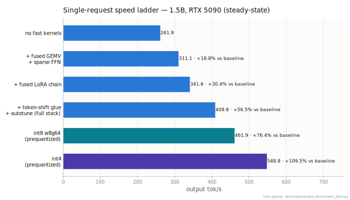

*Protocol: steady-state bsz1 decode at context 1024, prefill-subtracted (the serving-scale
harness's own number). Raw: `ladder_{base,mid,lora,full,w8,w4}_5090.log`. Regenerate:
`python bench/plots/make_benchmark_plots.py`.*

## 4. Quantization (what you trade and what you get)

Three modes, all with hand-written kernels, all arch-portable (JIT per GPU); the tier names are
decoded in the [glossary](#g-tiers), and [weight-only vs activation quant](#g-weight-vs-act) is
the load-bearing distinction between them:

| mode | accuracy cost | when it wins | checkpoints |
|---|---|---|---|
| int8 w8g64 (weight-only) | none measurable (greedy-exact; compression +0.0001) | small-batch speed (+13% over fp16 full stack at bsz1 on 5090) + half the weight bytes | ModelScope `Hakureirm/rwkv7-g1-1.5b-w8g64` |
| int8 w8a8 (tensor-core) | compression 0.6161 (+0.0076, == cutlass); **MATH500 avg@64 0.3812 vs fp16 0.4042 = −2.3pt** (the low-variance ruler resolves a real reasoning cost the compression rate and greedy hid — same pattern as int4, far milder) | large-batch throughput king on sm80–90 (3090 peak 9,851 tok/s, 64-in/256-out). On sm120/Blackwell the upstream cutlass op does not exist; rwkv-sglang's own s8-wmma kernel (register-blocked V2, bit-exact gate, batch-invariant) now serves the tier there — the int8 GEMM beats fp16 cuBLAS at M≥512 (1.03–1.55×), while e2e peak is 20,991 tok/s (@c512, 64-in/256-out) = 0.9466× fp16 (the residual gap is the per-token activation-quant launch tax against an already-tuned fp16 baseline) | box-relayable |
| int4 GPTQ | [lambada](#g-lambada) −1.28pt at 7.2B (RTN would be −2.64); **1.5B MATH500 avg@64 collapses regardless of symmetric/asymmetric (−25.6pt / −18.6pt vs fp16 — see below)** | lowest [VRAM](#g-vram): 7.2B in 4.6 GB weights, serves on a 16 GB T4 at 32.9 tok/s (reproduced 2026-07-09 at 32.8–33.6) + fastest single-stream decode on every card measured, 1.09–2.61× fp16 — full GPTQ/RTN/fp16 speed matrix in §4b | ModelScope `Hakureirm/rwkv7-g1-{1.5b,7.2b}-w4gptq` |

Prequantized checkpoints are required (the loader reads qweight/scale keys; pointing the
quant flags at an fp16 dir errors out by design).

**Where int8 is decisive — 7.2B on a single 32 GB 5090 (measured 2026-07-06; fp16 side
corrected 2026-07-07, [F0047](docs/findings/0047-fp16-72b-concurrency-correction.md)).**
RWKV-7 [state](#g-state) is constant-size, so the state-pool slot count is the max
[concurrency](#g-concurrency) (per-request state ≈ 33 MB, identical for both — it is fp32 model
state, independent of weight quantization).

**Correction:** the original fp16 sweep grid stopped at concurrency 221 on the untested
assumption that fp16 was already pinned at a hard OOM ceiling there. Re-running with a finer
grid past 221 (same launch, `--mem-fraction-static 0.85`) shows throughput was still
climbing, non-monotonically, well beyond that point: fp16's real safe operating ceiling is
**at least 344 concurrent** (368 boots clean but OOMs under real request load — thin-margin
allocator fragmentation in the eager prefill path, not a hard architectural cap at 221), and
its **true peak is 6,709 tok/s @ c320** (confirmed declining at c336: 6,039 and c344: 6,111)
— not 5,983 @ c192. The hand-kernel stack does carry real extra memory overhead beyond the
state pool, though: at matched `--cuda-graph-max-bs 320`, fp16 full-stack leaves only ~2.0 GB
free after cuda-graph capture vs bf16 stock's ~6.4 GB (identical weights, identical
state-pool math, identical launch) — so fp16 genuinely cannot push raw concurrency quite as
far as bf16 can. Its faster per-step compute more than compensates end to end: fp16's
corrected peak (6,709 @ c320) is still 8.7% above bf16's own peak (6,171 @ c256, §12), so the
hand kernels remain a net win, just a smaller one at the high-concurrency tail than at bsz1.
Same launch, cuda-graph ON, 64-in/256-out:

| 7.2B on one 5090 | max concurrency | peak output throughput |
|---|---|---|
| fp16 | **≥344** (was misreported as 221) | **6,709 tok/s @c320** (was misreported as 5,983 @c192) |
| **w8a8** | **640 (1.86×)** | **7,587 tok/s @c640 (1.131×, still climbing at 640)** |

Full concurrency sweep (output tok/s) — fp16's corrected curve peaks at 320 then declines
(no crash); w8a8 keeps scaling on its larger memory budget:

| concurrency | 1 | 128 | 192 | 221 | 256 | 320 | 336 | 344 | 368 |
|---|---|---|---|---|---|---|---|---|---|
| fp16 (corrected) | 124 | 5,688–5,695 | 5,999–6,034 | 5,769–5,772 | 6,186–6,205 | **6,709–6,714 (peak)** | 6,039 | 6,111 | OOMs under load |
| **w8a8** (unchanged) | 60 | 4,657 | — | 5,342 | — | 6,304 | — | — | — |

(fp16 range = two independent re-runs at `--cuda-graph-max-bs` 320 and 344, agreeing within
0.5% at every shared point: `bench/results/72b/sweep_72b_fp16_v2_5090.json` /
`sweep_72b_fp16_v3_5090.json`; original coarse-grid run kept as `sweep_72b_fp16.json` for
process record, no longer the current source of truth.) w8a8's curve is still rising at 640
(its own memory ceiling: 20.03 GB state pool, 1.92 GB free); the 7,587 is a memory-bound
floor, not a compute plateau. So int8 still serves 7.2B at a genuine **1.86× the concurrency
and a 13.1% higher peak than fp16 can reach on this card** (revised down from the previously
published 2.90×/26.8% — the fp16 side of that ratio was understated by an undertested grid,
the w8a8 side is unchanged) — fp16 is pinned nearer the memory limit, just less tightly than
previously thought. Honest mechanism: at matched concurrency ≤221 fp16 is faster per step (no
activation-quant tax); w8a8 wins by reaching concurrency fp16 cannot safely sustain. Raw:
`bench/results/72b/`.

**An honest int4 warning (measured 2026-07-05, updated 2026-07-07 with asymmetric + avg@64,
F0043):** perplexity-style metrics understate int4's damage to multi-step reasoning. On the 1.5B
GPTQ checkpoint, compression looks mild (0.6514 old N=7500 / 0.6330 clean N=300 symmetric) but
**MATH500 avg@64 is 0.1498** (32,000-rollout, 64-way temperature sampling — confirms the greedy
read of 0.1560 wasn't a decoding-strategy fluke) **vs fp16's 0.4060** — the quantized model loses
the thread mid-derivation and rambles to the token cap (57.7% [truncation](#g-truncation) vs
fp16's 14.2%, mean 1023 vs 581 generated tokens).

**Asymmetric (scale+zero) quantization — the cheap fix, tried first — helps for real but doesn't
solve it at 1.5B:** avg@64 improves to **0.2199** (truncation down to 30.5%), closing 27.4% of
the gap to fp16. That's a smaller fractional recovery than the same fix gets on lambada (35.0%)
or compression (32.9%) — the more decision-relevant the metric, the less a wider-but-still-4-bit
encoding buys back, which reads as evidence this is closer to compounding error over a long
reasoning chain than a simple "not enough bits" problem, *at this size*.

**Update (2026-07-08): the 7.2B version of this question has landed, and it changes the
picture substantially.** Same protocol (500×64 avg@64), same model family, four times the
parameters:

| 7.2B MATH500 avg@64 | score | vs fp16 | truncated |
|---|---:|---:|---:|
| fp16 (baseline) | **64.18%** | — | 6.3% |
| **symmetric GPTQ int4 (recommended)** | **61.08%** | **−3.1pt** | 14.0% |
| hybrid GPTQ int4 (ffn.value + ffn.key forced symmetric, rest asymmetric) | 56.03% | −8.15pt | 26.2% |
| asymmetric GPTQ int4 (all matrices) | 47.78% | −16.4pt | 8.1% |

**−3.1pt, not −25.6pt.** At 1.5B, symmetric int4 lost over a quarter of the model's MATH500
score; at 7.2B, the identical quantization scheme costs three points. This is a dramatic,
direct confirmation of the "bigger models quantize better" hypothesis this section flagged as
untested a session ago — it's no longer a hypothesis. **Decision: a full K-quant
mixed-precision rewrite (Stage 2) does not look necessary at 7.2B** — plain symmetric GPTQ is
already close enough to lossless on the hardest reasoning ruler this project has.

**The asymmetric attempt at 7.2B — a real finding, not a bug, and not a usable checkpoint.**
Full asymmetric GPTQ (the scheme that *helped* at 1.5B, closing 27% of the gap) instead
collapsed at 7.2B, landing well below symmetric rather than above it. Root-caused via
matrix-type ablation, not assumed: 32.2% of generations degenerated into a fixed,
prompt-independent short answer (the literal string "The final answer is 2." appears verbatim
across 44 different problems) — content-independent collapse, not gradual quality loss. Eight
alternative explanations were systematically ruled out with evidence each (wrong checkpoint,
corrupted weights, silent RTN fallback, a universal code bug — 1.5B's asymmetric path is
provably fine, sampling/cuda-graph artifacts, kernel shape-boundary errors, runtime fp16
rounding, and "asymmetric is objectively worse by MSE" — it is not: every one of the 192
quantized matrices has *lower* reconstruction error under asymmetric encoding, exactly as the
extra zero-point degree of freedom predicts). The actual cause: damage concentrates in the
`ffn.value` and `ffn.key` matrices specifically (forcing just those two back to symmetric while
leaving attention asymmetric drops the collapse rate on a curated probe set from 8/9 to 1/9 and
3/9 respectively) — these are the only two of six quantized matrix types fed an always-non-negative,
86–90%-sparse activation (`relu(k)²`), structurally unlike the roughly zero-mean activations
attention and the rest of the FFN see. This echoes an earlier, independent finding
([F0017](findings/0017-w4-int4-quant.md)) that asymmetric quantization systematically hurts
this model family in a way plain weight-MSE doesn't predict — a recurring, real sensitivity,
not a one-off.

**The obvious fix attempt — a hybrid checkpoint exempting just those two matrix types from
the asymmetric scheme — does not clear the bar either.** It recovers real ground over the
fully-asymmetric checkpoint (47.78% → 56.03%, +8.25pt, confirming the diagnosis), but lands
5pt *below* plain symmetric and, notably, with a *higher* truncation rate (26.2%) than either
extreme — a different failure mode, not fewer failures: the fully-asymmetric checkpoint's
degeneracy was a fast, short, content-independent collapse (low truncation, because a short
wrong answer ends within budget); the hybrid checkpoint instead loses the thread mid-derivation
and runs long without concluding, more often hitting the 1,500-token cap. **Verdict: plain
symmetric GPTQ remains the recommended 7.2B int4 checkpoint.** The asymmetric line of
investigation was worth running — it produced a real, evidenced finding about which matrices
in this architecture are sensitive to which quantization schemes — but it did not produce a
checkpoint worth shipping over the simpler symmetric baseline at this size. The 1.5B collapse
looks like a small-model-specific fragility, not a flaw in the quantization scheme itself;
int4's honest scope is "a genuine memory/speed win at 7.2B+ with symmetric encoding, use int8
instead of int4 for reasoning-heavy workloads specifically at 1.5B." Treat 1.5B int4
(symmetric or asymmetric) as a memory tool for non-reasoning workloads at that size, not a
general-purpose lossless tier — w8g64 (int8, weight-only) remains the lossless quantized tier
at every size measured. Raw:
`bench/results/math500_greedy_w4gptq_5090main.json` (1.5B greedy),
`bench/results/math500_avg64_7.2b_{fp16,sym,asym,hybrid_ffnvk}.json` (7.2B avg@64),
`docs/findings/0043-w4-asym-gptq.md` (1.5B full picture); a follow-up finding doc for the 7.2B
asymmetric collapse + hybrid investigation is pending.

**Figure — accuracy vs. speed frontier (7.2B), and the full MATH500 ladder across both
sizes.** The frontier plot puts single-stream speed and MATH500 avg@64 on one axis pair
for the configurations most deployments actually choose between; where the speed point
and the accuracy point weren't measured on the same card, the card is named right in the
annotation instead of left implicit — int4-GPTQ's speed (5090, §4b) and accuracy (3090,
F0055 §0) are a case in point. int8 w8a8/w8g64 has no landed MATH500 avg@64 raw at 7.2B
(only the compression-rate number in §2), so it's omitted from the frontier rather than
stood in for with a different metric. The ladder chart is the bar-form version of this
whole section: two 1.5B cells (int4-sym 14.98%, int4-asym 21.99% — both quoted in prose
above and in F0043) have no landed raw JSON, so those bars are left empty and marked "no
raw landed" rather than back-filled from the prose numbers.

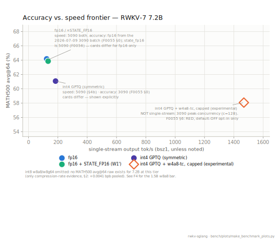

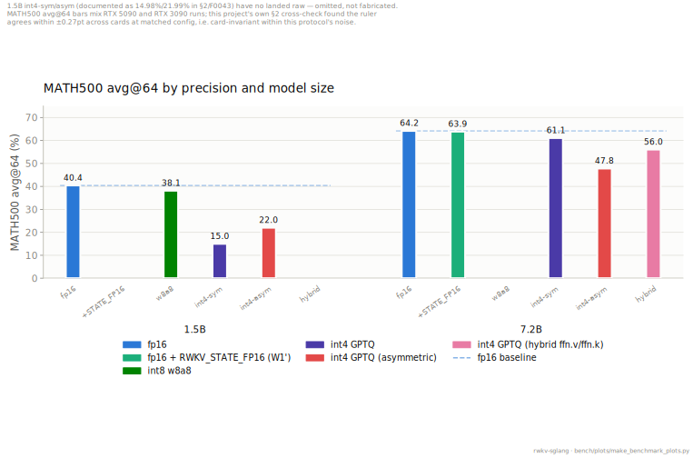

*Protocol: MATH500 avg@64 (500 problems × 64 samples), speed = single-stream wall-clock
unless the caption says otherwise. Raw: `math500_avg64_{5090main,w8a8_5090main}.json` (1.5B),
`math500_avg64_7.2b_{fp16,fp16_stateon,sym,asym,hybrid_ffnvk,w4gptq_w4a8capped_3090}.json`
(7.2B) + `72b/sweep_72b_fp16_v3_5090.json` + `w1prime_legFinal_B_7.2b_5090.json` +
`bsz_sweep_7.2b_w4gptq_5090.json` + `bsz_sweep_7.2b_w4gptq_3090_cliff_stage1_w4a8.json`
(speed axis). Regenerate: `python bench/plots/make_benchmark_plots.py`.*

**The [sm120](#g-sm) w8a8 kernel (GEMM microbench).** Upstream cutlass `int8_scaled_mm` does not
compile for sm120, so on Blackwell consumer cards our hand-written s8-wmma GEMM (register-
blocked "V2", bit-exact vs a per-row reference, batch-invariant) is the only int8 path. It
beats fp16 cuBLAS on the projection shapes at [decode/prefill](#g-prefill-decode) batch (RTX 5090, standalone
GEMM, × = our speedup over fp16):

| projection shape | M=512 | M=1024 | M=4096 |
|---|---|---|---|
| attn 2048×2048 | 1.08× | 1.33× | 1.52× |
| ffn.k 8192×2048 | 1.45× | 1.52× | 1.55× |
| ffn.v 2048×8192 | 1.03× | 1.28× | 1.53× |

The GEMM wins, but 1.5B e2e is 0.9466× fp16 (§5): the per-token activation-quant launch,
not amortized across ~144 heterogeneous decode kernels, plus an already-excellent fp16
baseline, eat the kernel's margin. That tax is latent on the VRAM-bound 7.2B case above,
where int8's real win (**1.86× concurrency**, corrected 2026-07-07 per F0047 — see above)
lives. Raw: `bench/verify_w8a8.py --bench`.

## 4b. int4 serving speed: GPTQ vs RTN vs fp16 (measured 2026-07-09/10)

§4 answers what int4 *costs* (accuracy); this section answers how fast it *serves* — a
direct question from BlinkDL: how fast is symmetric GPTQ int4? Protocol at every point
below: 64-in/256-out fixed-shape sweep, live server + `bench/bsz_throughput.py`
(wall-clock window), [cuda-graph](#g-cuda-graph) ON with explicit `--cuda-graph-max-bs`, one
server per GPU at a time. "Gate" = greedy token match vs the fp32 numpy oracle ([§1's
ruler](#g-oracle)), run against the same serving setup that produced the speed numbers.

**The direct answer: GPTQ and RTN are the same speed, everywhere.** At every card/model
pair where both were measured — the 5090 at 0.1B/1.5B/7.2B, the 3090 at 1.5B/7.2B,
T4/L4/A10G at 1.5B, A10G at 7.2B — every paired concurrency point agrees within 2.2%, most
within 1% (5090 7.2B: within 0.3% at all nine shared points; 5090 0.1B: mean |diff| 0.64%
over the full 8-point sweep; 3090 1.5B: within 1.9% at all six points), with one scoped
exception: the 3090's 7.2B pair differs by 3.1–4.2% at c=32/128 with RTN ahead
(single-stream still agrees at 1.7%). Same kernel, same layout — the runtime is
value-independent, so a calibration-induced speed difference has no mechanism there; we
read the 3090 7.2B drift as run-to-run scatter of a saturated 24 GB card, and report it
rather than average it away. This is exactly what the implementation predicts: both
checkpoints execute the identical `rwkv7_w4` kernel path with the identical qweight/scale
layout — GPTQ's calibration changes the *values* in the tensors, not one instruction at
runtime. So GPTQ-vs-RTN is purely an accuracy choice (§2/§4: GPTQ wins), never a speed
trade.

### RTX 5090 (sm120, full kernel-stack env)

**7.2B** (output tok/s; GPTQ and RTN gates both greedy-EXACT 8/8; fp16 spot-check on the
same box 8/8):

| concurrency | 1 | 8 | 16 | 32 | 48 | 64 | 96 | 128 | 256 | 384 | 512 |
|---|---|---|---|---|---|---|---|---|---|---|---|
| GPTQ int4 | 184.2 | 894.8 | 1,610.1 | 2,708.7 | 3,609.4 | 4,149.6 | 2,051.0 | 2,613.4 | 3,797.6 | 4,500.4 | **4,918.5 (peak)** |
| RTN int4 | 184.2 | — | — | 2,701.5 | 3,607.3 | 4,152.6 | 2,047.2 | 2,608.1 | 3,793.0 | 4,498.8 | 4,919.8 |
| fp16 full stack (published F0047 line, its own grid) | 123.7 | 666.4 | — | 2,363.2 | — | 4,033.9 | — | 5,688.1 | 6,205.3 | — | — |

The fp16 row is the already-published F0047-corrected sweep (peak **6,709.0 @c320**), cited
for comparison, not re-measured — only the fp16 8/8 spot-check gate was re-run to confirm
the env. Net: **int4 single-stream 184.2 vs 123.7 = +48.9% over fp16; int4 peak 4,918.5 =
73% of fp16's 6,709** — int4 is the latency/VRAM tier, fp16 remains the high-concurrency
throughput tier on this card.

**A reproducible artifact, documented rather than smoothed over — [the w4 cliff past
c=64](#g-m64).** On the 5090 the w4 curve collapses from 4,149.6 @c64 to 2,051.0 @c96, then climbs
back to 4,918.5 @c512. It is not noise: GPTQ and RTN reproduce it within 0.2% of each
other (2,051.0 / 2,047.2), and the c=128 point repeated across two independent runs within
0.4 tok/s (2,613.4 / 2,613.8). **Root cause confirmed (3090 fine map, 2026-07-10)** — this
section originally flagged the mechanism as suspected; a dedicated concurrency map on the
3090 has since pinned the edge at exactly **c=64→66** (1,429.5 tok/s @c=64 → 719.7 @c=66),
which is the M=64 boundary where the hand-written w4 tiers end (gemv M=1, small-batch 2–8,
wmma 8–64; `sglang_overlay/sglang/srt/layers/attention/rwkv7_kernels/w4_linear.py`) and
every projection falls back to dequant→cuBLAS. Two architectures, one edge, one mechanism
(sm86 + sm120 — the 5090's 64→96 gap simply never sampled the 65–95 range). Inside the
fallback region the batch is too small to amortize the per-step full-weight dequant: the
5090 wins it back by c≥256, while the 3090 never recovers its own c=64 level within the
24 GB card's c≤128 envelope (1,087.7 @c=128 in the map vs 1,429.5 @c=64) and stays below
fp16 throughout the region. Flagged for kernel work (an M>64 int4 tier). Operating
guidance until then: run 7.2B w4 at c≤64 (both cards) or c≥256 (5090); avoid the trough
just past 64. Raw: `bench/results/bsz_sweep_7.2b_w4gptq_3090_cliffmap.json` (c=48–128
map), `bench/results/bsz_sweep_7.2b_w4gptq_3090_cliffmap_fine.json` (c=66/72/76).

**Update (2026-07-13, task#52): the cliff is fixed at the kernel level.** A new tensor-core
GEMM (`gemm_w4a8_tc`, packed int4 weights × per-token int8 activations on the proven w8a8
s8-wmma pipeline) fills the M>64 hole that used to fall back to dequant→HBM→cuBLAS. Measured on
the 3090, same shape as the cliff map above (7.2B GPTQ, 64-in/256-out):

| concurrency | before (dequant→cuBLAS) | after (w4a8 tensor-core) | Δ |
|---|---|---|---|
| 48 | 1,303.0 | 1,323.0 | +1.5% |
| 64 | **1,407.0** (old peak) | 1,360.5 | −3.3% |
| 66 | 622.8 (cliff floor) | 931.4 | **+49.5%** |
| 72 | 653.5 | 996.4 | +52.5% |
| 80 | 713.4 | 1,077.8 | +51.1% |
| 96 | 817.8 | 1,225.5 | +49.9% |
| 112 | 912.0 | 1,346.8 | +47.7% |
| 128 | 998.4 | **1,468.5** (new peak) | +47.1% |

The old curve never recovers its c=64 peak by c=128; the new curve is monotonic through the old
cliff and sets a peak 4.4% above the old one at 2× the concurrency. The semantics change from
w4a16 (activations stay fp16) to w4a8 (activations quantized to int8 per token) above M=64, so
the kernel ships env-gated `RWKV_W4_TC_LARGE_M=1`, **default OFF**. Accuracy certification found
the per-token-int8 tax itself w8a8-class (compression +0.0042 bpb pooled, lambada −0.35pt, both
essentially noise) but MATH500 avg@64 RED in **both** dispatch configurations: unrestricted
M>64 (prefill included) 57.66% vs 61.075% baseline (−3.42pt, truncation 36.7% vs 14.0%), and
still RED after the same-day `RWKV_W4_TC_MAX_M=512` cap confined the kernel to the decode/cliff
range the table above measures — 58.07% (−3.00pt, truncation 33.0%), i.e. removing prefill from
the path recovered only +0.42pt while cutting wall time 8%. The damage is decode-side
per-token-int8 in the generation loop itself, not dispatch scope. **Final positioning: the
speed fix is real and stays available, but it is accuracy-gated** — in plain words: this
optimization **failed the accuracy exam ([RED](#g-gate))**, so it ships **default-OFF** and
exists only as an experimental [opt-in switch](#g-opt-in); whoever flips it on accepts the
measured −3pt MATH500 cost above. The flag pair remains that opt-in for throughput-tolerant
workloads (bulk/draft generation);
for accuracy-critical reasoning at high concurrency use the near-lossless w8 (g64 weight-only)
tier instead, or run w4 at c≤64 where the unchanged w4a16 kernels serve everything. Full
writeup, every number's raw citation, and the refuted-hypothesis analysis:
`docs/findings/0055-w4a8-large-m-tc.md`. Raw:
`bench/results/bsz_sweep_7.2b_w4gptq_3090_cliff_stage1_{base,w4a8}.json`,
`bench/results/math500_avg64_7.2b_w4gptq_w4a8{full,capped}_3090.json`.

**1.5B** (all three configs measured the same day on matched launch flags):

| config | c=1 | c=32 | c=128 | greedy gate |
|---|---|---|---|---|
| fp16 full stack | 336.1 | 6,917.2 | **17,694.6** | **24/24 EXACT** |
| GPTQ int4 | **426.2** (+26.8%) | **7,312.8** (+5.7%) | 9,973.7 (0.56×) | 10/24 (expected at 1.5B — see warning) |
| RTN int4 | 425.1 | 7,298.5 | 9,955.8 | 14/24 |

RTN tracks GPTQ within 0.3% at all three points. **Accuracy warning, load-bearing: 1.5B
int4 — either method — collapses on reasoning** (MATH500 avg@64 −25.6pt symmetric, §4); the
10/24 and 14/24 gates are the serving-layer face of the same fact. The speed rows are
kernel-valid measurements, but the 1.5B int4 checkpoints are **not recommended for
reasoning workloads** — int8 w8g64 is the lossless tier at this size (§4). int4's honest
1.5B scope is low-concurrency latency or memory-constrained non-reasoning serving.

**0.1B** (measured 2026-07-09; c=1/32/128 + peak shown here, full 8-point sweeps in the
raw files):

| config | c=1 | c=32 | c=128 | peak @c=512 | greedy gate |
|---|---|---|---|---|---|
| fp16 full stack | 990.5 | 20,870.7 | 54,405.6 | **103,601** | **24/24 EXACT** |
| GPTQ int4 | **1,157.9** | 20,203.1 | 53,787.5 | 93,997 | 4/24 — diverges, output stays coherent |
| RTN int4 | 1,160.2 | 20,485.4 | 54,581.9 | 93,490 | 1/24 — **degenerates into literal repetition** |

**Quality warning, printed next to the speed where it belongs: at 0.1B, RTN output is
broken** — not "slightly different" but repetition collapse (first divergence at token 0).
GPTQ at 0.1B diverges from the oracle yet remains coherent text. The speed rows are still
valid measurements (fixed-length decode, ignore_eos — throughput does not depend on token
identity), but deploying 0.1B RTN would be shipping a broken model at high speed. GPTQ-vs-RTN
speed parity holds across all 8 sweep points (mean |diff| 0.64%) — the parity survives even
where quality doesn't.

**0.1B real workload** ([ShareGPT](#g-sharegpt), `python -m sglang.bench_serving`, 500 prompts): fp16
31,255 output tok/s at rate=inf and 3,459 at rate=16; GPTQ 31,006 (−0.8%) and 3,476
(+0.5%) — the fixed-shape parity carries over to variable-length load at this size. RTN
ShareGPT was **not measured**: those two runs were blocked by an sglang-overlay version
drift against the serving image used for the fp16/GPTQ pair — an honest gap, stated rather
than papered over.

**1.5B / 7.2B real workload** (ShareGPT, same client, 500 prompts, seed 42; 5090 measured
2026-07-10, 3090 rows added same day; output tok/s):

| GPU | model | config | rate=inf | rate=16 |
|---|---|---|---|---|
| 5090 | 1.5B | fp16 full stack | **9,560.5** | 3,284.0 |
| 5090 | 1.5B | GPTQ int4 | 7,857.9 (−17.8%) | **3,347.8** (+1.9%) |
| 5090 | 7.2B | fp16 full stack | **2,995.4** | **2,552.8** |
| 5090 | 7.2B | GPTQ int4 | 2,209.0 (−26.3%) | 1,877.5 (−26.5%) |
| 3090 | 1.5B | fp16 full stack | **3,168.9** | **1,939.0** |
| 3090 | 1.5B | GPTQ int4 | 2,967.9 (−6.3%) | 1,820.2 (−6.1%) |
| 3090 | 7.2B | fp16 full stack | **755.8** | **734.8** |
| 3090 | 7.2B | GPTQ int4 | 593.1 (−21.5%) | 591.4 (−19.5%) |

Reading (5090): at rate=inf the server runs at full concurrency — squarely the M>64
dequant+cuBLAS region — so w4 trails fp16 at both sizes, exactly what the synthetic
crossover above predicts for this card. At a steady 16 req/s the 1.5B pair is parity
(+1.9%, the same picture as 0.1B's −0.8%/+0.5%); the 7.2B pair is not, because 16 req/s ×
~221 mean output tokens ≈ 3.5k tok/s of demand exceeds even fp16's own full-blast 2,995 —
at 7.2B this rate is mild overload rather than steady state (same caveat class as §7c's
3090 note), so the high-concurrency penalty stays visible (−26.5%). Reading (3090): fp16
leads w4 at every point (fp16 +27% over GPTQ at 7.2B rate=inf) — this box cannot sustain
16 req/s at either size (§7c already documents that for 1.5B; here the 7.2B GPTQ pair's
two rates land nearly identical, 593.1 vs 591.4 = pure capacity saturation), so every
3090 ShareGPT point is effectively the full-concurrency regime, where the synthetic matrix
says fp16 wins — the two rulers agree. Protocol identity, checkable in the raws: all
twelve 5090 runs (0.1B/1.5B/7.2B rounds) used the same canonical ShareGPT_V3 file and each
processed exactly 198,233 input / 110,378 generated tokens; the eight 3090 runs used that
box's own ShareGPT file — 161,035 / 98,420, identical across all eight — so within-box
pairs are equal-conditions, while cross-box rows are not same-prompt comparisons. Both
5090 7.2B servers ran capped at 344 concurrency (a matched pair; a 512-slot state pool is
~17.4 GB of fp32 state at ≈34 MB/request, which plus 13.9 GB of fp16 weights does not fit
in 32 GB — 344 is the F0047-established safe ceiling, §4); the 3090 7.2B legs ran at their
box's 128 cap (see the ‡ note below). RTN ShareGPT: deliberately not run at 1.5B/7.2B on
either box — GPTQ≈RTN speed parity is already verified at the nine paired points above.

Raw (5090): `bench/results/bsz_sweep_7.2b_w4gptq_5090.json` (c=1/32/128) +
`bench/results/bsz_sweep_7.2b_w4gptq_5090_ext.json` (the other eight points),
`bench/results/bsz_sweep_7.2b_w4rtn_5090.json`,
`bench/results/bsz_sweep_1.5b_{fp16,w4gptq,w4rtn}_5090.json`,
`bench/results/bsz_sweep_0.1b_{fp16,w4gptq,w4rtn}_5090.json`; gates
`bench/results/greedy_gates_7.2b_{w4gptq,w4rtn,fp16_spotcheck}_5090.log`,
`bench/results/greedy_gates_1.5b_{fp16,w4gptq,w4rtn}_5090.log`,
`bench/results/greedy_gates_0.1b_w4_5090.log`; ShareGPT
`bench/results/sharegpt_{0.1b,1.5b,7.2b}_{fp16,w4gptq}_5090_{rinf,r16}.log`; fp16 7.2B comparison line
`bench/results/qwen35/rwkv7_7.2b_fp16_fullstack_resweep_5090_v3.json`.

**Figure — the ShareGPT fp16-vs-GPTQ matrix.** One small panel per card × model (each on
its own scale — 0.1B's 31k and the 3090's 7.2B 756 don't share an axis honestly), peak and
16 req/s side by side, the GPTQ bar's Δ% recomputed from the two plotted values. The
missing 0.1B RTN pair is the same overlay-version-drift gap the prose above discloses.

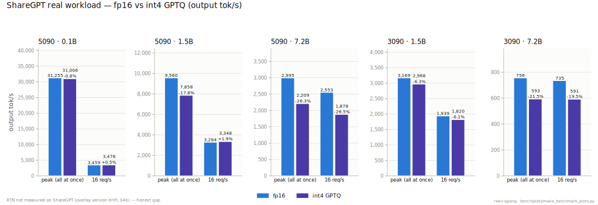

*Protocol: §4b's ShareGPT rounds — 500 prompts, seed 42, within-box equal-conditions. Raw:
`sharegpt_{0.1b,1.5b,7.2b}_{fp16,w4gptq}_5090_{rinf,r16}.log` +
`sharegpt_{1.5b,7.2b}_{fp16,w4gptq}_3090_{rinf,r16}.log`. Regenerate:
`python bench/plots/make_benchmark_plots.py`.*

**Interactive dashboard (hover / zoom / toggle tiers):
[hakureirm.github.io/rwkv-sglang/interactive/](https://hakureirm.github.io/rwkv-sglang/interactive/)** —
the F1/F2/F3/F4/F5 figures below are static SVGs; the dashboard renders the same landed raws
with hover tooltips, dataZoom, legend-click tier toggling, and an absolute/ratio-vs-fp16 view
switch for F1/F2.

**Figure — per-size concurrency curves, RTX 5090.** Every line is drawn straight from the
raw sweeps cited above (nothing hand-entered — see the manifest in
`bench/plots/make_benchmark_plots.py`). The fp16 + `RWKV_STATE_FP16` (W1') series is the
sparse spot-check §4b/§5 report (1 point at 1.5B, 3 at 7.2B), not a full sweep, so it's
plotted as unconnected markers rather than a curve implying coverage that wasn't measured.

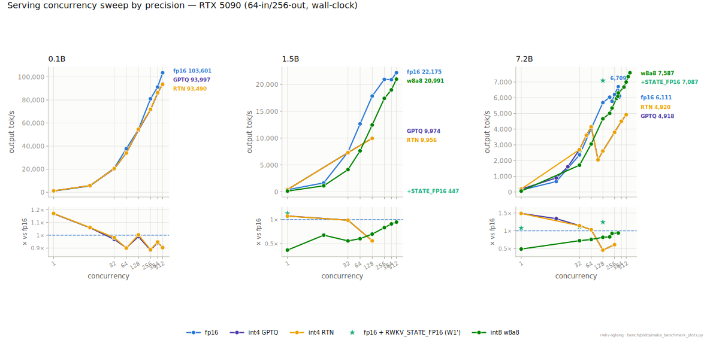

*Protocol: 64-in/256-out, wall-clock, cuda-graph ON. Raw: the `bsz_sweep_{0.1b,1.5b,7.2b}_{fp16,w4gptq,w4rtn}_5090*.json`
family + `bsz_sweep_fullstack_5090.json` + `bsz_sweep_w8a8v2_5090main.json` (§4b/§5) +
`w1prime_leg{Ef_1.5b,Final_B_7.2b}_5090.json` (F0056) +
`72b/sweep_72b_{fp16_v3,w8a8,w8a8_ceil,w8a8_max}_5090.json` (F0047). Regenerate:
`python bench/plots/make_benchmark_plots.py`.*

### The desktop 3090 + five more cards, same recipe (measured on the real cards)

1.5B, output tok/s at c=1 / c=32 / c=128 (greedy gate in parens):

| GPU | fp16 | GPTQ int4 | RTN int4 |
|---|---|---|---|
| RTX 3090 (sm86)‡ | 220.1 / 3,517.9 / 7,077.5 (24/24 EXACT) | 298.0 / 3,550.3 / 4,811.2 (10/24) | 293.2 / 3,530.8 / 4,786.4 (14/24) |
| T4 (sm75) | 64.0 / 1,225.5 / 2,648.3 (24/24 EXACT) | 114.4 / 1,140.1 / 1,820.5 (10/24) | 112.3 / 1,115.2 / 1,796.6 (14/24) |
| L4 (sm89) | 74.1 / 1,634.9 / 3,551.3 (24/24 EXACT) | 149.4 / 2,110.4 / 2,776.7 (10/24) | 147.6 / 2,070.5 / 2,729.1 (14/24) |
| A10G (sm86) | 103.7 / 2,539.5 / 5,578.6 (24/24 EXACT) | 191.9 / 2,722.6 / 3,734.2 (10/24) | 190.9 / 2,691.1 / 3,681.7 (14/24) |
| A100-40GB (sm80) | 156.3 / 3,959.9 / 10,346.2 (24/24 EXACT) | 198.1 / 3,845.2 / 6,839.7 (10/24) | not re-run (parity above) |
| H100 (sm90) | 226.1 / 6,025.5 / 16,482.7 (24/24 EXACT) | 246.5 / 5,172.3 / 9,842.6 (10/24) | not re-run (parity above) |

7.2B, same columns:

| GPU | fp16 | GPTQ int4 | RTN int4 |
|---|---|---|---|
| RTX 3090 (24 GB)‡ | 68.7 / 1,051.4 / 1,837.3 | 105.9 / 985.1 / 1,072.1 (8/8 EXACT) | 104.1 / 1,015.9 / 1,117.6 (8/8 EXACT) |
| T4 | 16.3 / n.m. / n.m. | 32.8 / 288.5 / 390.5† (8/8 EXACT) | not re-run |
| L4 | 17.1 / 405.6 / 723.4 | 44.7 / 538.8 / 625.5 (8/8 EXACT) | not re-run |
| A10G | 28.9 / 726.4 / 1,223.8 | 67.5 / 797.3 / 946.2 (8/8 EXACT) | 68.0 / 800.5 / n.m. (8/8 EXACT) |
| A100-40GB | 61.3 / 1,584.2 / 3,995.7 (8/8 EXACT) | 93.0 / 1,420.1 / 1,996.3 (8/8 EXACT) | not re-run |
| H100 | 101.5 / 2,789.0 / 7,497.3 (8/8 EXACT) | 125.1 / 2,230.7 / 3,070.8 (8/8 EXACT) | not re-run |

† T4 @c=128 on 7.2B is technically alive but overloaded — not a usable operating point: p50
latency 72.5 s, p99 145.1 s, 3.1 tok/s per stream. n.m. = not measured. On the three
smallest cards the 7.2B **fp16** oracle gate was killed by the per-run time budget (rc −9
in the raw) — those fp16 cells carry no correctness claim; the 3090's 7.2B fp16 leg ran no
oracle gate either (its 1.5B fp16 24/24 served as the box's stack sanity); every 7.2B
GPTQ/RTN gate that ran is 8/8 EXACT.

‡ 3090 (24 GB) scope, disclosed rather than smoothed: **(1)** serve.sh's default 512-slot
state pool cannot boot **any** 7.2B tier on 24 GB (512 × ~33.5 MiB of RWKV state alone
blows the budget), so every 3090 7.2B leg — fp16 and w4 alike — ran at
`--max-running-requests 128`; the 7.2B c=128 values are that cap, not a swept optimum.
**(2)** The 7.2B fp16 leg additionally needed the decode-graph capture list trimmed to
`--cuda-graph-bs 1 32 128` (the full capture list OOMs at c=128 chunked prefill), and its
ShareGPT legs `--chunked-prefill-size 2048`. **(3)** The 3090 container runs an earlier
overlay snapshot in which the two fused-kernel flags later promoted to default
(gates/sqrelu) are inert; its effective stack is the 5-env fast path. All six 3090 legs
share that identical config — within-box comparisons are self-consistent — but absolute
levels sit slightly below §5's published 3090 numbers (fp16 1.5B bsz1 220.1 here vs 230.7
there). The 1.5B legs were swept to c=512 like the 5090: GPTQ 5,969.8 / **6,218.4 (peak)**
/ 6,118.9 and RTN 5,860.8 / 6,184.1 (peak) / 6,170.0 at c=256/384/512, vs fp16 7,310.4 /
**7,347.3 (peak)** / 6,994.2 — that fp16 peak lands in the same band as §5's published
full-stack 7,257.7 @c=384 (+1.2%), an external consistency anchor for this box's whole
matrix. Full boot flags, OOM notes and gate list:
`bench/results/bsz_sweep_3090_serve_flags.log`.

**What the matrix says.**

1. **int4 wins single-stream on every card, 1.09×–2.61× over fp16** (low end H100 @1.5B,
   high end L4 @7.2B; the desktop 3090: 1.35× @1.5B, 1.54× @7.2B), and on every card the
   7.2B ratio beats that same card's 1.5B ratio — the bigger the model relative to the
   card, the more the 4× weight-byte cut matters.
2. **fp16 overtakes at high concurrency everywhere measured** — batched fp16 GEMM beats
   batched dequant+cuBLAS once weight bytes stop being the bottleneck. **The crossover
   point is a property of the card, not of the model tier:** T4, A100-40GB and H100 cross
   early (fp16 already ahead by c=32); L4 and A10G cross late (int4 still ahead at c=32,
   fp16 ahead by c=128); the 5090 at 1.5B also crosses late; the 3090 crosses right at the
   boundary on both sizes (7.2B: fp16 +6.7% by c=32; 1.5B: a dead heat at c=32, GPTQ +0.9%,
   fp16 clearly ahead by c=128). Wherever both model sizes were measured on a card, the
   card keeps its crossover class. Why T4 groups with A100/H100 rather than with its
   bandwidth-class neighbours L4/A10G is unresolved — stated, not explained away.
3. **Bigger models quantize cleaner — now confirmed at the serving layer too:** 7.2B GPTQ
   is greedy-EXACT on all seven cards measured (5090, 3090, T4, L4, A10G, A100-40GB,
   H100); 1.5B is exact nowhere (10/24 GPTQ / 14/24 RTN, the same match counts on every
   card and architecture — the 3090 even reproduces the same first-divergence tokens,
   div@10 / div@14). An independent, serving-layer cross-check of §4's MATH500 verdict
   (7.2B −3.1pt vs 1.5B −25.6pt) — two rulers, one conclusion.

**Deliberately not run, and why:** RTN on A100/H100 at 1.5B and on T4/L4/A100/H100 at 7.2B
— GPTQ≈RTN speed parity was already verified at nine paired card/model points above, and
re-proving it per card buys nothing. B200/H200/A100-80GB/L40S — the cards measured already
characterize the finding. (The 3090 run this section previously listed as pending —
blocked by container-registry blob failures — has landed; its rows are above.)

Raw (3090): `bench/results/bsz_sweep_{1.5b,7.2b}_{fp16,w4gptq,w4rtn}_3090.json`, gates
`bench/results/greedy_gates_1.5b_{fp16,w4gptq,w4rtn}_3090.log` and
`bench/results/greedy_gates_7.2b_{w4gptq,w4rtn}_3090.log`, ShareGPT
`bench/results/sharegpt_{1.5b,7.2b}_{fp16,w4gptq}_3090_{rinf,r16}.log`, cliff map
`bench/results/bsz_sweep_7.2b_w4gptq_3090_cliffmap{,_fine}.json`, boot-flag sidecar
`bench/results/bsz_sweep_3090_serve_flags.log`.

Raw (other cards): `bench/results/w4_speed_fleet/` — one JSON per server run, named
`<GPU>_<model>_<config>.json`, each carrying the device string, gate result and full sweep
rows (`*_v2` / `*_c128` / `*_full` / `*_retry` / `*rtn2` = follow-up runs after a first
attempt hit a time budget or stopped at a partial sweep; the partial first attempts are
kept for the record).

**Figure — per-size concurrency curves, RTX 3090, including the w4 M=64 cliff.** The 7.2B
panel overlays the base fp16/RTN matrix with the dense int4-GPTQ cliff map (the c=64→66
edge from the fine map) and the w4a8-tc experimental fix (F0055) — drawn dashed with
hollow markers because it is a default-OFF, accuracy-gated opt-in (§4b) — plain words: it
failed the accuracy exam ([RED](#g-gate)), so it does nothing unless an operator explicitly
enables it and accepts the measured accuracy cost — not a recommended-path number. `bsz_sweep_7.2b_w4gptq_3090_cliff_stage1_base.json` is consumed
as the matched control for the w4a8 delta (F0055 §1) but not drawn as its own line — it
reproduces the plotted cliff-map curve within ~1.6% at shared points (1,407.0 vs 1,429.5
tok/s @c=64), and a near-duplicate line would only add clutter.

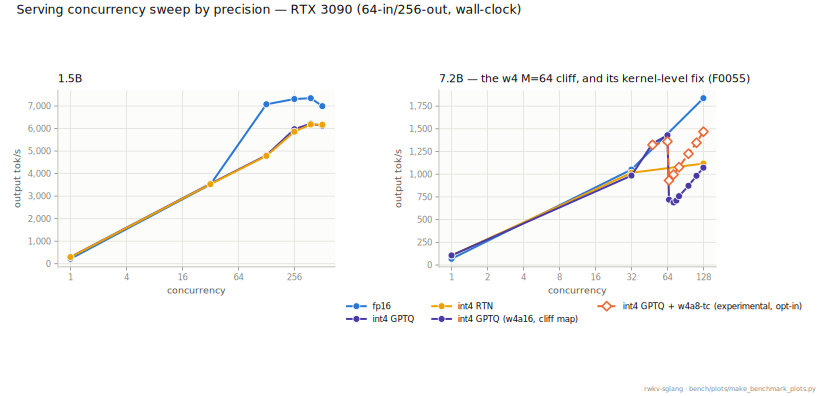

*Protocol: 64-in/256-out, wall-clock, cuda-graph ON. Raw: `bsz_sweep_{1.5b,7.2b}_{fp16,w4gptq,w4rtn}_3090.json`
+ `bsz_sweep_7.2b_w4gptq_3090_cliffmap{,_fine}.json` + `..._cliff_stage1_w4a8.json` (F0055).
Regenerate: `python bench/plots/make_benchmark_plots.py`.*

### `RWKV_STATE_FP16` — a recommended throughput switch (2026-07-13, F0056)

Orthogonal to the three weight-quantization modes in §4: this flag halves the **temporal WKV
[recurrent state](#g-state)**'s storage from fp32 to fp16 (token-shift/conv state and the in-register fp32
accumulation are unaffected — this is a storage-only change, the WKV kernel's arithmetic does
not move). Same treatment as the quantization tiers above: a named opt-in, disclosed accuracy
cost next to the speed number, default left OFF so the [bitwise-oracle tier](#g-exact-tier) (§1) stays reachable
with zero flags. In plain words: this switch **passed** all four accuracy exams ([GREEN](#g-gate))
and is recommended — it defaults to off only so that "zero flags" keeps meaning "bit-for-bit
exact"; turning it on is a documented choice, not a hidden one.

**Capacity effect** (independently confirmed via reported free memory at matched batch size,
not only computed from byte-widths): per-request state **7.2B 33→17 MB, 1.5B 12.98→6.68 MB** —
at a 512-slot pool this is **1.5B 6.01→3.01 GB**, i.e. the same memory budget fits roughly twice
the concurrent state.

**[Gate](#g-gate) ladder, all green** (full derivation, every raw cited:
`docs/findings/0056-w1prime-serving-fixes.md`):

| ruler | OFF | ON | Δ |
|---|---|---|---|
| lambada (1.5B, n=5153) | 0.67126 | 0.67145 | +0.02pt |
| compression (1.5B, N=300 pooled bpb) | 0.5892803 | 0.5892813 | ~+1e-6 |
| **MATH500 avg@64 (7.2B, the decisive ruler)** | **64.18%** | **63.86%** | **−0.32pt** (well inside the ±0.6pt-at-2σ noise band this protocol carries — see F0055 §5 for the derivation) |

**Serving win** (RTX 5090, 7.2B fp16, shape A 128-in/1,280-out, on top of the byte-exact glue
fusions that are now default — see `docs/findings/0056-w1prime-serving-fixes.md` for the full
per-fusion ledger): c=320 **7,603.5 → 9,406.1 tok/s (+23.7%)**; full final sweep c=64 **4,999.1**,
c=128 **7,755.6**; internal step-time profiling put the same decode step at 39.27ms → 31.31ms.
1.5B single-stream (64-in/256-out): **421.2 → 447.3 (+6.2%)**. Raw:
`bench/results/w1prime_leg{A_anchor,B_state,Final_A,G1_vres,E0,Ef}_*_5090.json` (full leg-by-leg
ledger, including the individually-isolated glue fusions, in the finding doc above).

**Positional compression curve — the long-context gate (fourth gate, PASS).** Re-measured
§2's position curve with the flag on vs off (7.2B fp16, full UncheatableEval corpus, 7,500
docs, RTX 3090, F0057): pooled bpb **0.5413279 vs 0.5413279 (Δ = −5.4e-8)**; per-bucket
Δ stays inside the same-flag rerun noise band (~1e-5 bits) at every bucket with real sample
mass, with alternating sign and **no positional slope** — no measurable error accumulation
over sequence position. Honest scope: the corpus's longest document is ~3.3k tokens (the
checkpoint is ctx8192-trained, so all evaluated positions are in-distribution); beyond that
the instrument has no data. For contrast, the w4a8 activation-quant tax measured on this
same ruler (F0055) is ~1,700× larger per bucket.

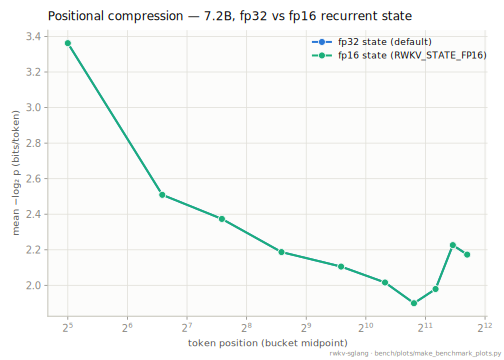

*Both state precisions trace the same curve at every position bucket — the two lines
overlap to within line width. 7.2B fp16, UncheatableEval 2026-04 (15 corpora, 7,500 docs),
positions to ~3.3k tokens. Raw:
`bench/results/uncheatable_positional_7.2b_fp16_state{32,16}_3090.json` (+ two same-flag
noise-replication runs, `..._noiserep{1,2}.json`). Regenerate:
`python bench/plots/make_benchmark_plots.py`.*

## 5. Serving throughput (RWKV-7 1.5B, wall-clock, 64-in/256-out, concurrency sweep)

RWKV-7 1.5B, sglang main. "single request" = bsz1; "peak" = best over the concurrency sweep.

| config | RTX 3090 main | RTX 5090 main |
|---|---|---|
| plain fp16, single request | 153.7 | 256.8 |
| plain fp16, peak | 7,205.5 @ 384 conc | 22,090.8 @ 512 |
| full kernel stack, single request | 230.7 | 397.3 |
| full kernel stack, peak | 7,257.7 @ 384 | **22,175.3 @ 512** |
| int8 w8a8 + fused glue, peak | **9,850.9 @ 256** | 20,991 @ 512 (own s8-wmma kernel V2; 0.9466× fp16 — GEMM >fp16, e2e just under) |
| full kernel stack + `RWKV_STATE_FP16` (opt-in, F0056), single request | not measured this session | **447.3** |

v0.5.10 reference points: 3090 plain peak was 6,885, w8a8+glue 9,686 — the main migration
alone made the 3090 faster. Raw: `bench/results/bsz_sweep_*_{3090main,5090}.json`; the
`RWKV_STATE_FP16` row is `bench/results/w1prime_legEf_1.5b_5090.json` (baseline for that row,
same config minus the flag: `bench/results/w1prime_legE0_1.5b_5090.json`, 421.2 — +6.2%).

Known pitfall reproduced on main: sglang defaults `cuda_graph_max_bs` to 24 for this model
family, silently falling back to eager above it — always set `--cuda-graph-max-bs` explicitly
(serve.sh does).

**Same protocol, 7.2B, RTX 5090** (2026-07-13, W1' final config — `RWKV_STATE_FP16` + all five
byte-exact glue fusions; full ledger and every isolated fusion's contribution:
`docs/findings/0056-w1prime-serving-fixes.md`):

| concurrency | tok/s |
|---|---|
| 1 (single request) | 133.4 |
| 32 | 2,636.4 |
| 128 | 7,087.3 |

Raw: `bench/results/w1prime_legFinal_B_7.2b_5090.json`.

## 6. The 10-GPU fleet (same code, same recipe, every card)

1.5B fp16 full stack on sglang main, wall-clock. **Single-request = [bsz1](#g-bsz1) sustained decode
(steady state); [peak](#g-peak) = best total throughput over a 64-in/256-out concurrency sweep** (capped
at 384 concurrency on the fleet, 512 on the workstation 5090):

| GPU | arch | single request | peak |
|---|---|---|---|
| T4 | sm75 | 97.1 | 3,176 |
| L4 | sm89 | 102.2 | 4,627 |
| A10G | sm86 | 168.3 | 6,627 |
| A100-40GB | sm80 | 257.0 | 17,042 |
| A100-80GB | sm80 | 278.9 | 18,420 |
| L40S | sm89 | 238.0 | 13,352 |
| H100 | sm90 | 361.1 | 28,578 |
| H200 | sm90 | 399.3 | 32,289 |
| B200 | sm100 | 381.6 | **40,544** |
| RTX PRO 6000 | sm120 | 315.0 | 21,566 |
| RTX 5090 (workstation) | sm120 | **397.3** | 22,175 |

Notable: at single-request the consumer RTX 5090 matches H200 (397.3 vs 399.3) and beats
H100 and B200 — single-stream decode is a memory-bandwidth story and GDDR7 delivers. Raw:
`bench/results/fleet_main_10cards.json`.

**Figure — the fleet, both readings side by side.** Each panel is sorted by its own metric,
which is the point: the single-request ranking (bandwidth story — the consumer 5090 sits
between H200 and B200) is not the peak ranking (total-throughput story — the HBM cards pull
away, B200 on top). Peak tags carry the concurrency the sweep hit it at.

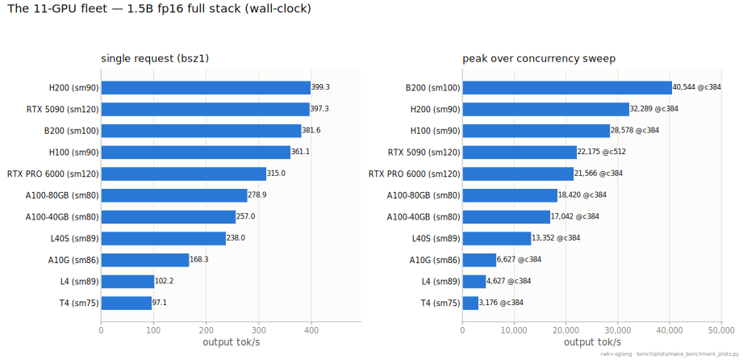

*Protocol: 1.5B fp16 full stack, 64-in/256-out, wall-clock. Raw: `fleet_main_10cards.json`
(10 cloud cards) + `bsz_sweep_fullstack_5090.json` (the workstation 5090, same recipe).
Regenerate: `python bench/plots/make_benchmark_plots.py`.*

## 6b. Multi-GPU: TP / PP (verified on main, cuda-graph ON)

[Tensor- and pipeline-parallel](#g-tp-pp) (TP/PP), on sglang main under the production cuda-graph path (F0019's
matrix was cuda-graph OFF). 1.5B bf16, 2×L4, wall-clock tok/s, **64-in/256-out** (c1/c8/c32/c64
= concurrency). **TP=2 and PP=2 are both greedy 24/24 identical to single-GPU and
deterministic** — multi-GPU changes nothing about the output. (Getting PP here first required
fixing a cuda-graph capture crash — F0036.)

| config | greedy vs 1-GPU | c1 | c8 | c32 | c64 (peak) | vs tp=1 |
|---|---|---|---|---|---|---|
| tp=1 (1 GPU) | reference | 72.6 | 482.3 | 1,612.9 | 2,582.6 | — |
| **tp=2** | **24/24 exact** | 105.3 | 655.9 | 2,008.6 | **3,026.2** | **1.17×** |
| **pp=2** | **24/24 exact** | 65.4 | 367.7 | 1,365.5 | 2,288.8 | 0.89× |

Honest read: at 1.5B on PCIe-connected L4s, TP=2 buys ~1.17× at c64; PP=2 is 0.89×
(pipeline bubbles dominate at this model size — PP's job is fitting a model larger than one
card, not per-token speedup for a small one). The value is that both are **correct and
production-viable** on main; scaling for models that actually need multiple cards (7.2B+,
NVLink) is a follow-up. Raw: `bench/results/tppp_l4_main.json`.

**Figure — the three configs over concurrency.** The end-of-line ratios are the c=64
vs-tp=1 values recomputed from the plotted points; the 24/24-exact greedy verdicts ride in
the legend labels because they are the headline (multi-GPU changes nothing about outputs).

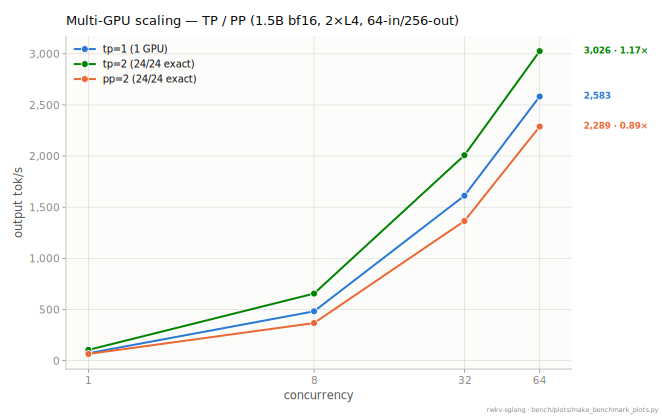

*Protocol: 1.5B bf16, 2×L4, 64-in/256-out, cuda-graph ON. Raw: `tppp_l4_main.json`.
Regenerate: `python bench/plots/make_benchmark_plots.py`.*

## 7. Comparison with Albatross (BlinkDL's official speed reference)

Albatross is a forward-loop benchmark (no scheduler, no dynamic batching, no API); this
comparison answers exactly one question — raw single-stream speed — with the same 1.5B
weights file on every card. Its shipped constants were tuned by the author on his own
RTX 5090, so "stock" is its best case there and its out-of-box state everywhere else.
Timing note: the Albatross column excludes prompt reading, ours includes it (~3% against us),
so these ratios are conservative lower bounds.

| GPU | Albatross (tok/s) | ours (tok/s) | ours / Albatross |
|---|---|---|---|
| T4 | **stock kernel won't compile** (sm80+ `cp.async`; removable — see note†) | 97.1 | out-of-box, only we run |
| L4 | 113.5 | 102.2 | **0.9004** |
| A10G | 203.4 | 168.3 | 0.8274 |
| L40S | 291.8 | 238.0 | 0.8156 |
| A100-40GB | 341.3 | 257.0 | 0.7530 |
| A100-80GB | 385.5 | 278.9 | 0.7235 |
| RTX 3090 | 309.2 (we re-tuned it for this card) | 230.7 | 0.7461 |
| RTX PRO 6000 | 457.4 | 315.0 | 0.6887 |
| RTX 5090 (author's own card) | 553.9 | 397.3 | 0.7173 |
| H100 | 607.3 | 361.1 | 0.5946 |
| H200 | 684.3 | 399.3 | 0.5835 |
| B200 | 744.0 | 381.6 | 0.5129 |

† The T4 gap is the *shipped* Albatross WKV kernel's `cp.async` (an sm80+ instruction); BlinkDL
notes this is removable — a patched kernel runs on T4 — so it's a packaging limit, not a fundamental
one. The claim here is strictly out-of-the-box: our stack serves T4 unmodified, and we have not
benchmarked a hand-patched Albatross on T4.

How to read it: the gap tracks memory bandwidth ([bandwidth-bound](#g-bound) territory). On inference cards we are close (0.90 on
L4); on HBM monsters its whole-layer fused kernel stretches ahead (0.51 on B200) because our
per-operator launch overhead grows in relative terms as compute gets faster — which is
precisely what our next speed increment (CUDA graphs + deeper fusion) targets. Meanwhile our
**int4 path reaches 0.9908× of Albatross's fp16 on the author's own 5090** (548.8 vs 553.9,
cross-precision), and the T4 row shows the coverage difference. Raw:
`bench/results/albatross_fleet_10cards.json` + per-run logs.

One more finding: on CUDA 12.9 the constants Albatross ships are no longer optimal even on
the 5090 they were tuned for. We went further and **re-tuned Albatross for this card
ourselves** (14 dispatch-table edits, every one verified numerically and end-to-end, one
false win from an L2-resident microbench caught and reverted — full diff and evidence in
`bench/results/albatross_5090/`). Result, stock → re-tuned on the RTX 5090 (median of 3):

| model | batch | decode | prefill |
|---|---|---|---|
| 0.1b | 1 / 8 / 32 | +0.0% / **+11.0%** / +0.0% | +0.9% / +2.2% / **+13.4%** |
| 1.5b | 1 / 8 / 32 | +0.0% / **+6.6%** / **+7.9%** | +5.2% / +1.9% / +2.9% |
| 7.2b | 1 / 8 / 32 | +0.0% / +3.5% / +0.0% | +1.2% / +2.9% / **+5.0%** |

Single-stream decode does not move (memory-bandwidth wall — stock 7.2b at 147.0 tok/s already
exceeds the author's own published 144.04); the batch shapes gain up to 13%. A physics note so
that 147.0 survives adversarial review: it is ~14% *above* the dense-fp16 read floor (13.9
GB/step ÷ 1.792 TB/s theoretical ⇒ ≤128.7 tok/s), which is legitimate, not a timing artifact —
Albatross's default channel-mix is a lossless sparse FFN (`CMIX_SPARSE="no-fc"`; its README
calls it "sparse FFN (lossless)") that skips the `ffn.value` rows whose relu² activation is
zero. At the 90.2% sqrelu sparsity we measured on 7.2B (`docs/design/m6-sparse-ffn.md`),
per-step traffic is ~10.1 GB ⇒ ~1.48 TB/s effective — 87% of the 1.69 TB/s read bandwidth we
measured on this card (ADR-0008 A0 probe). Our own bsz1 numbers ship the same class of
optimization (`RWKV_SPARSE_FFN=1` in `scripts/serve.sh`), so neither engine's bsz1 decode
should be judged against a dense-read ceiling. Our single-request
ratios above are against the stock numbers; against the re-tuned track they are unchanged at
bsz1 (554.0 vs 553.9). Our launch parameters re-select at warmup on any card+CUDA — the design
difference the next table quantifies.

**Ongoing work on the bandwidth gap (2026-07-07, F0051).** The table above predates F0051/F0052
and reflects the config of the day (all fusion flags off). **As of 2026-07-08 that is no longer
the recommended default** — see the promotion note at the end of this subsection. A real kernel-launch profile on H100 (699 launches per
full decode step, not the ~144 an earlier internal estimate assumed — re-measured via
`torch.profiler`, don't trust the old figure) found the highest-launch-count still-unfused
cluster (the LoRA-output gate math: 3 sigmoids + surrounding elementwise) and fused it into
one kernel, bit-exact on both sm_89 and sm_90 (`max_abs_diff = 0.0`), gated behind
`RWKV_FUSED_GATES` (raw env default off, additive, doesn't touch the numbers above — see
promotion note below). Measured effect,
isolating exactly this change (a bsz8 control where the fusion doesn't fire shows ~0% change
on both cards, confirming clean A/B isolation): **H100 bsz1 359.4→392.6 (+9.24%, ratio vs
Albatross 0.592×→0.646×); L4 bsz1 82.1→83.1 (+1.22%)** — the much larger H100 gain for the
identical code change is itself evidence the gap really is bandwidth-correlated, not just an
observed pattern with an unconfirmed cause. Honest ceiling from the same profiling pass: even
fusing every remaining tiny elementwise kernel this way tops out around H100 0.69× — the
larger remaining piece is that our GEMV kernels run their epilogues as separate launches
where Albatross's mega-kernel fuses them inline; that fusion (higher blast-radius — it touches
the GEMV kernels every quantization tier depends on) is in progress. See
[F0051](findings/0051-lora-gate-fusion-highbw.md) and later findings in that sequence for the
current state; this is explicitly long-term/iterative (task #5), not expected to fully close.

**Update (2026-07-07, F0052).** Built and measured the first "epilogue-fuse into the GEMV"
candidate named above: folding the FFN's `relu(key(xk))**2` activation (2 elementwise launches)
directly into the `ffn.key` GEMV's own store, instead of running it as separate kernels after.
Byte-exact (`torch.equal`) on both sm_89 and sm_90, including a check that the quantized tiers
(w4, w8a8) are bit-identically unaffected. Measured effect, same isolation method as above:
**H100 bsz1 393.2→404.3 (+2.82%, independently reproduced at +2.72%; ratio vs Albatross
≈0.65×→0.66×); L4 bsz1 83.1→83.3 (+0.24%, noise-level)** — real on the high-bandwidth card, a
non-event on the low-bandwidth one, the same correlation as F0051 again, but a much smaller win
than the LoRA-gate fusion (proportional to the smaller 2-launch cluster it collapses, vs. ~7-8).
Kernel-level accounting shows the fused epilogue itself costs ~0 extra GPU time, so this **revises
the ceiling above from ~0.69× to ~0.71×**. Gated behind `RWKV_FUSED_SQRELU` (raw env default off,
additive; mutually exclusive with `RWKV_SPARSE_FFN` by construction — it's the epilogue-fusion
fallback for sparse's own dense-fallback path, not a second lever stacked on top of it).
See [F0052](findings/0052-sqrelu-epilogue-fusion-highbw.md).

**Promotion to default (2026-07-08).** Both flags are byte-exact gated individually (op-level +
end-to-end `verify_batch.py` greedy-EXACT vs. the numpy oracle) with zero observed regressions on
either tested card, and quantized-tier blast-radius containment confirmed. `scripts/serve.sh`
(the recommended production launch) now exports both ON, re-verified with **all 7 fast-path flags
on simultaneously** (1.5B fp16, cuda-graph, vs. numpy oracle): `OVERALL: PASS (all batches exact)`
— the shipped combo is gated as a whole, not assumed to compose from individually-tested pieces.
Disclosed scope gap: both are byte-exact-verified on sm_89 (L4) + sm_90 (H100) only, not the
11-card matrix the other fast-path flags accumulated over time — a narrower-published-speed-number
issue, not a correctness one (see `scripts/serve.sh` header for the full reasoning).

## 7a. Albatross at large batch: same code on a single RTX 5090 (7.2B fp16)

The tables above stop at batch 32; Albatross's own headline numbers live at the other end of
the batch axis — the README's "15000+ / 17000+ / 21000+" tok/s (7.2B decode B1024 / prefill
T1024 / batch-prefill B32×T32) and the chart published alongside. Attribution first, because
it decides how the table below should be read: **per Bo Peng's own public statement on Zhihu
(2026-07-10), the official headline numbers were measured on an RTX Pro 6000**, not a 5090 —
in his words: "这里是用pro6000测的,5090会低一些,但更大bsz会更高,因此差不多" ("this was
measured on a Pro 6000; a 5090 will be a bit lower, but larger bsz climbs higher, so it comes
out about the same"). The grid below is the same public code at the same commit (`343147a`,
the `faster3a` tree plus the `faster3_2605` variant the README names its headline numbers
under, author-default script, flags and protocol) on a single, fully idle **RTX 5090** —
published so 5090 users have a same-card reference to put next to the official Pro 6000
figures. Two cards, one code; here are both sets of numbers.

7.2B fp16, tok/s. Each cell = mean of two independent process repeats (each repeat = the
author's default protocol: 1 warmup + 3 timed iters, CUDA-event p50):

| shape (B seqs × T tokens) | class | faster3a stock | faster3a re-tuned (ours) | faster3_2605 stock | official headline (RTX Pro 6000, per Bo) |
|---|---|---|---|---|---|
| 1 × 1 | decode | 147.5 | 147.4 | 83.9 | 144.04 (chart) |
| 8 × 1 | decode | 898.5 | 929.5 | 741.7 | 913 (chart) |
| 32 × 1 | decode | 2955.0 | 2955.3 | 2847.8 | 2851 (chart) |
| 64 × 1 | decode | 4662.2 | 4663.8 | **5335.5** | — |
| 128 × 1 | decode | 8914.1 | 8899.1 | 8592.0 | — |
| 256 × 1 | decode | 9622.2 | 9627.3 | 9522.4 | 13126 (chart) |
| 1024 × 1 | decode | 10648.0 | 10739.7 | 10426.6 | "15000+" (README) |
| 1 × 256 | prefill | 9751.2 | 9742.8 | 9699.3 | — |
| 1 × 1024 | prefill | 11276.8 | 11380.0 | 11138.2 | "17000+" (README) |
| 16 × 16 | batch prefill | 11603.4 | 11612.1 | 11478.3 | 17291 (chart) |
| 32 × 32 | batch prefill | 13829.5 | 13929.2 | 13675.5 | "21000+" (README) |

Reading notes, in the order they matter:

- **The methodology cross-validates at small batch.** At the small-batch shapes the official
  chart and this grid share (B1/B8/B32 decode), the stock numbers land within ±4% of the
  chart even across the two different cards (147.5 vs 144.04, 898.5 vs 913, 2955.0 vs 2851) —
  exactly the "差不多" (about the same) regime Bo describes for small batch. The B1 147.5
  here vs the 147.0 quoted in §7 prose is protocol, not drift: this grid runs the
  author-default 1-warmup/3-iter loop, the earlier number came from our longer
  3-warmup/20-iter re-run (0.3% apart).
- **At large batch the two cards separate.** The 5090 lands 27–34% below the Pro 6000
  headline figures (best variant per shape: B256 9,627 vs 13,126; B16×16 11,612 vs 17,291;
  and against the README's "15000+/17000+/21000+": 10,740 / 11,380 / 13,929). Same code,
  different card — the direction Bo's own statement anticipates. An independent community
  reproduction on another RTX 5090 (shared in community chat; not a published artifact,
  variant/tuning unknown) lands within ~5% of this grid at all three README shapes.
- **The two trees trade places by shape.** `faster3_2605` is much slower single-stream on
  this card (83.9 vs 147.5 at B1) but is the faster tree at B64 (5,335.5 vs 4,662.2, +14%);
  everywhere else `faster3a` leads. Our 5090 re-tune (the same 14-edit diff as above,
  `bench/results/albatross_5090/retuned_diff.txt`) adds ≤1% at the large-batch shapes; B8's
  +3.5% remains the biggest re-tune win, matching the per-size table above.
- **One OOM, disclosed.** The `faster3a` full-grid process OOMs at B1024 on the 32 GB card
  after the preceding cases; the two `faster3a` B1024 cells were measured in a dedicated
  fresh process (recorded as their own run-groups in the raw). `faster3_2605` completed the
  whole grid, B1024 included, in one process.
- **Scope guard.** This is a kernel-harness measurement class: static uniform batches inside
  one forward loop — no scheduler, no dynamic batching, no API (§7 lead). Our own engine's
  7.2B numbers are full-stack serving measurements and live in §4b/§5 — the two classes are
  not cell-to-cell comparable, which is why our numbers stay out of this table.

Repeat stability: the two process repeats agree within 0.11% on every cell except the two
B128 cells (0.46% stock / 0.82% re-tuned). Raw (both repeats, p10/p50/p90 per cell, and the
official/community reference numbers as recorded):
`bench/results/albatross_5090/large_batch_grid.json`.

**Figure — both Albatross comparisons in one place.** Top: §7's per-card single-stream
pairs, sorted by the Albatross value, with the ours÷Albatross ratio computed from the two
plotted numbers (the 3090's Albatross bar is the value *after* our per-card re-tune, tagged
right on the bar; T4 draws ours only). Bottom: §7a's large-batch grid as a dot plot on a log
axis — our two-repeat means for all three code variants on the single RTX 5090, with the
official chart values and README claims drawn as reference markers and labeled with the
same per-Bo RTX Pro 6000 attribution the table above carries; two cards, one code, both
shown, neither smoothed into the other.

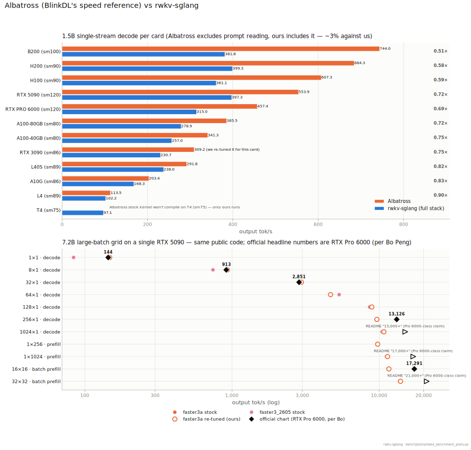

*Raw: `albatross_fleet_10cards.json` + `fleet_main_10cards.json` + `albatross_3090.md` (§5
table) + `albatross_5090/retuned_summary.json` + `bsz_sweep_fullstack_{3090main,5090}.json`
(top panel); `albatross_5090/large_batch_grid.json`, including its recorded
official/README reference numbers (bottom panel). Regenerate:
`python bench/plots/make_benchmark_plots.py`.*

## 7b. Comparison with vllm-rwkv (the community vLLM fork)

Measured 2026-07-06 under strictly equal conditions, **RWKV-7 1.5B**: same GPUs (RTX 3090 + RTX
5090), same weights file (1.5B, tensor-verified), same client logic (the sweep client ported to the
vllm-rwkv OpenAI endpoint, identical 64-in/256-out protocol), vllm-rwkv at its documented best config.
Disclosure: the vllm-rwkv tip (`4bf0239a1`) crashes on the first decode as shipped (an
interface mismatch introduced by its automated upstream rebase); all vllm-rwkv numbers below
required a documented 2-line compatibility fix to run at all. That branch force-push rebases
daily — pin commits when reproducing.

**Correctness:** vllm-rwkv's fp16 engine also reproduces the fp32 numpy-oracle fixture 24/24
token-exactly on both GPUs — two independent engines converging on the same reference is
mutual validation, recorded plainly to vllm-rwkv's credit.

**Throughput, vllm-rwkv / rwkv-sglang full-stack (wall-clock, in64/out256):**

| concurrency | RTX 5090 | RTX 3090 |
|---|---|---|
| 1 | 1.1352 (vllm-rwkv leads) | **0.8114 (rwkv-sglang leads: 230.7 vs 187.2)** |
| 8 | **0.9204 (rwkv-sglang leads)** | **0.8947 (rwkv-sglang leads)** |
| 32 | **0.9866** | **0.9980** |
| 64 | **0.9858** | **0.9557** |
| 128 | 1.0507 | **0.9745** |
| 256 | 1.2194 | 1.0985 |
| peak (512/384) | 1.2621 (27,988 vs 22,175) | 1.1702 (8,493 vs 7,258) |

**Reading it honestly:** vllm-rwkv's kernels are Albatross's (ported file-by-file), so single-stream
tracks the Albatross baseline — vllm-rwkv leads bsz1 on the 5090; on the 3090 rwkv-sglang's hand-written
GEMV stack beats the port outright. rwkv-sglang leads the c8–64 middle on the 5090. **vllm-rwkv leads
high concurrency on both cards (up to 1.26×)** — that is the real result of this comparison
and rwkv-sglang's next kernel target. Two counters already exist: on the 3090 rwkv-sglang's int8 w8a8 peak
(9,851) beats vllm-rwkv's fp16 peak (8,583) by **1.1477×**; on the 5090 the upstream cutlass
int8 op does not exist; rwkv-sglang's own s8-wmma kernel (V1) now runs the tier there end-to-end
(20,991 @c512 = 0.9466× fp16; the int8 GEMM itself is 1.03–1.55× fp16 at M≥512) — the availability gap is closed, and the 3090
ratio is 1.38×) is the single highest-leverage speed item. Raw:
`bench/results/vllmrwkv/` (correctness JSONs with full token ids + both sweeps per card).

> The 3090 column is the clean re-measurement (`_v2`, max_num_seqs sized to 24GB): it
> reproduces the first box run within ~2% at every point (if anything slightly lower), so the
> earlier numbers were sound — the 3090/5090 asymmetry is a real hardware effect (higher
> bandwidth favors the fused-layer kernels at high concurrency), not a config artifact.

## 7c. Real-workload comparison (ShareGPT, variable-length conversations)

The synthetic sweep above uses one fixed shape (64-in/256-out). Real serving is
variable-length, which stresses the scheduler differently. **RWKV-7 1.5B**; same neutral client
(`sglang.bench_serving`), same ShareGPT file, same 500 prompts, same weights (1.5B), each engine
at its best config. Two load levels: peak (all requests at once) and steady (16 req/s). Equal-conditions proof:
all 8 runs processed exactly 168,913 input tokens and generated exactly 109,861 output tokens
— same prompts in, same tokens out (identical weights + greedy + ignore_eos).

**Output throughput (tok/s) and latency, RTX 5090:**

| load | engine | output tok/s | median TTFT | p99 inter-token |
|---|---|---|---|---|
| peak | rwkv-sglang | **9,602** | **2,503 ms** | **20.5 ms** |
| peak | vllm-rwkv | 8,865 | 3,458 ms | 370.8 ms |
| 16 req/s | rwkv-sglang | 3,300 | 31.6 ms | 37.8 ms |
| 16 req/s | vllm-rwkv | 3,351 | 24.1 ms | 22.7 ms |

**RTX 3090:**

| load | engine | output tok/s | median TTFT | p99 inter-token |
|---|---|---|---|---|
| peak | rwkv-sglang | **3,974** | **7,297 ms** | **717 ms** |
| peak | vllm-rwkv | 2,805 | 12,750 ms | 1,595 ms |
| 16 req/s* | rwkv-sglang | 2,477 | **316 ms** | 1,239 ms |
| 16 req/s* | vllm-rwkv | 2,600 | 375 ms | 375 ms |

*The 3090 can't actually sustain 16 req/s on this model (both engines top out ~11–12 req/s),
so this row is mild overload, not true steady state. The 5090 handles 16 req/s comfortably.

**The reversal — and it's the point.** On the *synthetic fixed-shape* sweep, vllm-rwkv led
high concurrency (its Albatross kernels + decode-wave batching like uniform shapes). On
*real variable-length* load at peak, **rwkv-sglang leads throughput on both cards** (1.08× on
the 5090, 1.42× on the 3090) with lower median [time-to-first-token](#g-ttft) — sglang's continuous
dynamic batching packs uneven requests without the bubbles a wave scheduler leaves on
variable shapes. At steady 16 req/s the two are within a few percent on throughput, and
tail latency is mixed (vllm-rwkv's steady-state inter-token tail is tighter; rwkv-sglang's
peak-load tail is far tighter on the 5090). Net: for realistic mixed-length serving at high
load, rwkv-sglang is ahead; at light steady load they trade. Raw: `bench/results/realload/`.

**Figure — the reversal, drawn.** Throughput bars per card and load level with each run's
median TTFT printed inside its own bar — the peak-load groups are where rwkv-sglang leads
on both cards (and with the lower TTFT); the steady-16 groups are the near-tie the prose
describes, including the 3090's overload caveat carried into its group label.

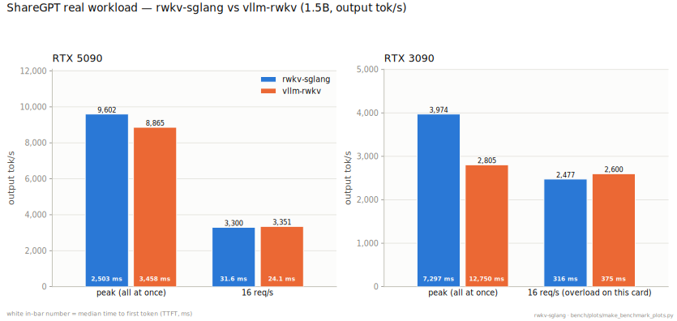

*Protocol: §7c's own — 500 ShareGPT prompts, identical tokens in/out per card. Raw:
`realload/{sglang,vllm}_{5090,3090}_{inf,r16}.json`. Regenerate:
`python bench/plots/make_benchmark_plots.py`.*

## 8. Launch autotune across cards (why hardcoded constants don't travel)

Kernel-level A/B of our GEMV launch autotune vs the built-in heuristic, on the **RWKV-7 1.5B**
projection shapes (att_rkvo / ffn_key / ffn_value; interleaved 4-pass median; only the
numerically-safe axis is tuned by default). Gain = time saved on that shape:

| GPU | att_rkvo / ffn_key / ffn_value | takeaway |
|---|---|---|
| T4 | +7.6% / +5.6% / +2.5% | wins where the heuristic misses |
| L4 | +0.1% / +11.3% / **+24.1%** | biggest win |
| A10G | +0.1% / +0.3% / +2.1% | near-parity |
| A100-40/80 | ≤ +4.9% | mixed |
| L40S | +0.0% / +9.2% / +2.6% | wins |
| H100 / H200 / B200 | ≈ 0 | heuristic already optimal |
| RTX 3090 | 0% ± noise | honest zero (serving-level, 7 runs) |
| RTX 5090 | +0.0% / +3.2% / +5.0% | tile choice differs from heuristic at 170 SMs |

Raw: `bench/results/autotune_ab_9cards.json`, `autotune_ab_5090.json`. F0025 has the
methodology (including the clock-ramp artifact that forced the interleaved design).

**Figure — the same table, sorted, with the honest zeros kept in view.** One bar per projection
shape per card; each gain is recomputed in-figure as `heuristic_us / best_locked_us − 1`, and
cards are sorted by their best-shape gain — L4's +24.1% `ffn_value` on top, the H100/H200/B200
"heuristic already optimal" zeros at the bottom, drawn not dropped.

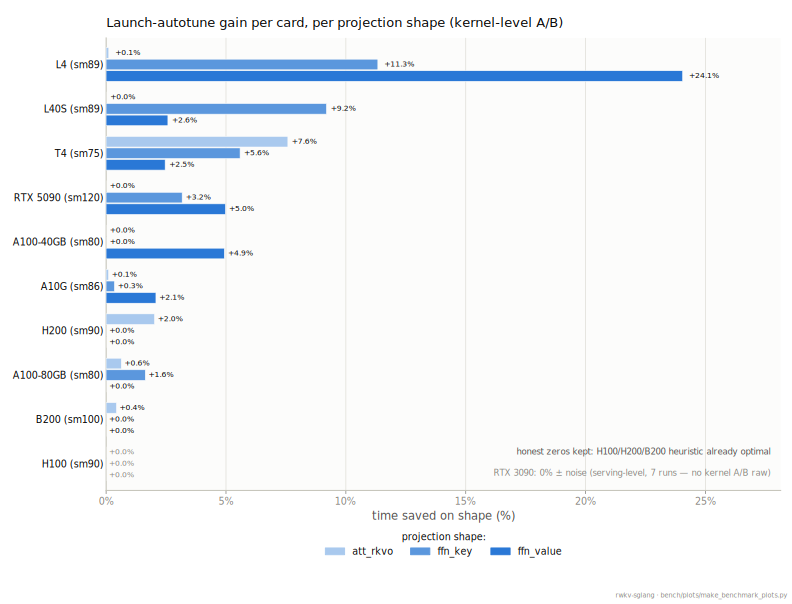

*Protocol: kernel-level A/B, interleaved 4-pass median (F0025). Raw: `autotune_ab_9cards.json`
(9 cloud cards) + `autotune_ab_5090.json`; the RTX 3090's serving-level zero has no kernel A/B raw
and is noted on-figure. Regenerate: `python bench/plots/make_benchmark_plots.py`.*

## 9. Latency under real load

**Poisson arrivals** (RWKV-7 1.5B; requests arrive at a fixed average rate; 512-in/256-out; RTX 5090 main):

| arrival rate | output tok/s | TTFT p50 / p99 | per-token p50 / p99 |
|---|---|---|---|
| 2 req/s | 524 | 23.6 / 43.4 ms | 3.8 / 5.1 ms |
| 8 req/s | 2,047 | 26.6 / 52.2 ms | 5.1 / 5.5 ms |
| 16 req/s | 3,977 | ~27 / ~52 ms | ~5 / ~5.5 ms |
| 300 at once | 11,865 | 1.7 / 3.3 s | 18.6 / 24.7 ms |

No queueing below 16 req/s — first-token latency stays ~26 ms. The 3090 (v0.5.10) reference
had 302 ms TTFT at 16 req/s. Raw: `bench/results/pd_mixed_5090.json`, `pd_mixed_3090main.json`.

**Figure — the same table, plus one measured rate the prose skips.** TTFT on a log axis
(the 300-at-once flood is 60× the steady-state p50 — a linear axis would flatten every
usable operating point into the floor), per-token latency linear, throughput as the third
panel; the raw carries a 4 req/s row the table above omits, and the figure draws it.

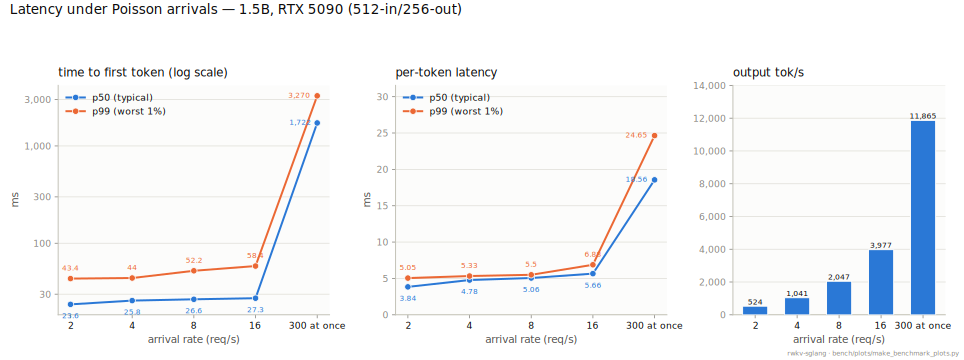

*Protocol: 512-in/256-out, 300 requests per rate, RTX 5090 main. Raw: `pd_mixed_5090.json`.
Regenerate: `python bench/plots/make_benchmark_plots.py`.*

**ShareGPT** (RWKV-7 1.5B; real conversation lengths, standard `bench_serving`, 500 requests, RTX 5090):
peak 9,845.6 output / 27,527.7 total tok/s; at 16 req/s median TTFT 32.3 ms. Raw:
`bench/results/sharegpt_{peak,r16}_5090.log`.

## 10. The structural advantage: constant-size state

| scale axis | baseline | scaled | extra peak VRAM |
|---|---|---|---|
| concurrency 1 → 256 (1.5B, 3090) | 12,420 MiB | 12,622 MiB | **+202 MiB** |
| context 1K → 64K (1.5B) | 12,364 MiB | 12,368 MiB | **+4 MiB** |
| context 1K → 32K (7.2B) | 17,866 MiB | 17,866 MiB | **+0 MiB** |
| concurrency 1 → 64 (7.2B, 24 GB card) | 46.6 tok/s | 1,802.7 tok/s | +308 MiB |

A Transformer's [KV cache](#g-kv-cache) grows on both axes; RWKV-7's [state](#g-state) does not. This is why a single
32 GB 5090 serves **640 concurrent 7.2B streams** with w8a8 (§4) — the state pool is the only
thing that scales with concurrency, and it is tiny and fixed-per-request. (The VRAM-growth
rows above are v0.5.10 measurements; unchanged by design on main.)

## 11. Speculative decoding

**Updated 2026-07-07 — correctness done, speed a real partial win.** A 0.1B RWKV-7 draft
proposes K tokens; the target verifies them in one pass via sglang main's own spec-V2
plugin architecture (`RWKV_SPEC`, modeled on the `NGRAMWorker` template — reusing upstream's
verify+commit machinery rather than a bespoke worker, per the [2026-07-06 pivot in
ADR-0006](adr/0006-speculative-decoding.md)); rejected tokens roll back via an O(1) state
snapshot.

Plain-words status first: [speculative decoding](#g-spec) is the "fast intern drafts, expert
verifies" trick. Here the **correctness half is fully done** — with the feature on, outputs are
still token-identical to normal decoding — but the **speed half is not**: end to end it is
currently *slower* than not using the feature at all, so it stays off. It is documented anyway
because this project records negative results with the same rigor as wins.

**Correctness: `bench/spec_gate.py` is 10/10** token-identical (spec-on vs spec-off, greedy),
holding at both 128 and 256 generation length, with zero regression on the pre-existing
non-spec-decode suite. Getting there required fixing two real bugs specific to RWKV-7's
recurrent state (not present in the transformer-oriented backends this machinery was built
for): `intermediate_ssm`/`intermediate_conv_window` are indexed by request-ordinal, not pool
slot; and RWKV-7's *second* token-shift state (the FFN one, `conv[1]`) was never corrected by
the generic upstream commit hook, which only ever handled `conv[0]` (GDN/KDA/Lightning only
have one token-shift-equivalent state each).

**Speed: a hand-rolled CUDA graph for the draft's own decode loop** (not sglang's shared
`DecodeCudaGraphRunner`, which hardcodes an EAGLE-family batch shape incompatible with a plain
recurrent draft) gives a real, gated **1.5–1.6× speedup on the draft decode step itself**
(median 33.2→53.7 tok/s, positive on all 7 test prompts). Net effect against not using
speculative decoding at all: **still 2.6×–4.5× slower** (down from 7× before the graph) — a
real, honest, partial step, not yet the win this feature is meant to deliver. Three profiled-
but-not-yet-attacked next levers on record (per-layer state-clone cost, target-verify
overhead, per-round Python orchestration).

Full analysis: [F0046](findings/0046-spec-decode-strategy-b-build.md) (this build),
[F0031](findings/0031-spec-decode-increment-i.md) (the superseded v0.5.10-era prototype,
kept for the M-shape-reduction-order lesson it taught), F0029 (viability, α=0.738–0.7485),
ADR-0006 (design).

## 12. Apple Silicon (MLX)

Native RWKV-7 for Apple Silicon — MLX + a hand-written Metal WKV kernel, gated by the **same numpy
fp32 oracle** as CUDA. The MLX port **matches the CUDA platform's coverage**: kernel profiling,
quantization, the compression-rate ruler, and a real-workload bench — all on **Apple M5 (32 GB
unified, MLX 0.31.2)**. This is a shared box, and decode jitter comes in two sizes depending on what
you compare: **within** one back-to-back session it stays tight (~1–5%: 10 fresh consecutive runs on
2026-07-07 landed at 36.2–36.5 tok/s for 1.5B fp16 decode), but **across** sessions (different
times/days, same code, same `mlx`/`mlx-lm` versions) the session median has been observed to swing
**up to ~12% peak-to-trough** — 32.8–37.3 tok/s across five independent 1.5B-fp16 decode sessions on
2026-07-06/07 (full breakdown: [F0045](findings/0045-qwen35-mlx-matched-benchmark.md) addendum).
Treat a single session's absolute tok/s as a point-in-time reading, not a fixed constant — the
headline quant deltas below are more robust because they use **interleaved one-process A/B**
(baseline+variant back-to-back per round, which cancels cross-session drift too), and `bench_mlx.py`
reports median+best.

### 12.1 fp16 default — correctness + speed (Metal WKV, bf16 weights)

| | 0.1B | 1.5B | 7.2B |
|---|---|---|---|
| greedy vs numpy oracle | 24/24 | 24/24 | 8/8¹ |
| decode, single stream (tok/s) | 325.6 | 37.3 | 7.5 |
| prompt reading, 1024 tok (tok/s) | 11,486 | 1,905 | 441 |
| peak memory | 0.54 GiB | 3.38 GiB | 14.64 GiB |

¹ the 7.2B oracle fixture is 8 tokens (0.1B/1.5B are 24) — all three token-exact on BOTH the pure-ops
and Metal WKV paths; 7.2B fp16 fits in 32 GB with headroom. The fused Metal WKV kernel is the default
(prompt-reading 4.4–8.1× faster than the pure-ops scan; `RWKV_MLX_WKV=pure` = JIT-free fallback).
[F0037](findings/0037-mlx-fused-metal-default.md), [F0038](findings/0038-mlx-m5-kernel-profiling.md).

### 12.2 M5 hardware ceilings + where single-stream time goes (F0038)

Measured M5: **memory bandwidth ~123 GB/s**, matmul ~11.4 TFLOP/s @2048² / ~13.2 @4096². bsz1 decode
reads every weight once per token (1.5B ≈ **2.88 GB/token**) → a **hard ceiling of ~42.7 tok/s**, and
we measure ~33.6 = **79% of it**. So the decode lever is *fewer weight bytes* (quant, §12.3), not more
fp16 kernel tuning (an in-graph ablation zeroing the big projections takes decode 34→400 tok/s —
decode *is* the weight read). Shipped kernel win: decay-precompute in the WKV scan (D× fewer `exp`,
**bit-exact**) → prefill **+0.8% / +1.8% / +3.1%** (0.1B/1.5B/7.2B); prefill chunk 256 near-optimal.
Negatives recorded (not re-tried): T>1 prefill compile = +13% but broke 0.1B bit-exactness → reverted.

### 12.3 Quantization — MLX-native w8g64 / w4g64 (F0039), opt-in; fp16 stays the exact default

`RWKV_MLX_QUANT=w8|w4` (`mx.quantize` group-64, mirrors CUDA w8g64/w4-g64; weight-only, bf16 acts):

| model | mode | greedy vs oracle | decode tok/s (med / best) | prefill tok/s | peak mem |
|---|---|---|---:|---:|---:|
| 0.1B | fp16 | 24/24 | 325.6 / 331.9 | 11,486 | 0.54 GiB |
| 0.1B | **w8** | **24/24** | **417.3 / 475.7** | 8,458 | 0.43 GiB |
| 0.1B | w4 | 4/24 | 588.1 / 593.4 | 7,831 | 0.36 GiB |
| 1.5B | fp16 | 24/24 | 37.3 / 39.1 | 1,905 | 3.38 GiB |
| 1.5B | **w8** | **24/24** | **55.5 / 56.0** | 1,908 | 2.28 GiB |
| 1.5B | w4 | 24/24² | 94.0 / 95.8 | 1,975 | 1.65 GiB |
| 7.2B | fp16 | 8/8 | 7.5 / 7.9 | 441 | 14.64 GiB |
| 7.2B | **w8** | **8/8** | **12.6 / 12.9** | 484 | 8.88 GiB |
| 7.2B | w4 | 8/8² | 22.0 / 22.9 | 513 | 5.76 GiB |

- **w8 = greedy-lossless, the recommended quant**: decode **+28% / +49% / +68%** (0.1B/1.5B/7.2B),
  peak mem **−20% / −33% / −39%**, greedy output identical to the fp32 oracle. Drift-cancelled 1.5B
  interleaved A/B: fp16 31.4 → **w8 52.0 (+66%)** → w4 85.1 (+171%).
- **w4 = footprint / max-decode play**: decode **+81% / +152% / +193%**, peak **−33% / −51% / −61%**
  (7.2B in 5.76 GiB), at a real accuracy cost (§12.4).
- ² w4's 24/8-token greedy match is coincidental agreement, not losslessness (0.1B w4 already diverges
  greedily, 4/24). Prefill under quant: 0.1B −26% (small-model prefill is compute-bound → dequant
  tax), 1.5B ~flat, 7.2B +10% (large enough that prefill is partly bandwidth-bound too).

### 12.4 Accuracy — compression rate (uncheatable, same metric as CUDA §2) (F0040)

Direct-call harness (`compression_mlx.py`; MLX has no HTTP server), 1.5B, 15 corpora × 40 docs, pooled
bits/byte (lower = better):

| precision | pooled bpb | vs fp16 |
|---|---:|---:|
| fp16 | **0.5926** | — |
| w8 | 0.5929 | **+0.0003 (lossless)** |
| w4 | 0.6430 | +0.0504 |

Mirrors the CUDA column (w8g64 +0.0001, int4 +0.0429): w8 lossless on the ruler, int4 a real cost.
Position curve 3.62 → 2.19 bits ([0-64)→[1024+)) — the O(1) state keeps absorbing context (CUDA:
3.65→2.24).

### 12.5 Real workload — ShareGPT single-stream (F0041)

150 real ShareGPT conversations (first-human-turn prompts; length min/p50/mean/max = 8/51/244/1865
tok), bsz1 streaming, max_new = 128:

| precision | TTFT p50 / p90 / p99 (ms) | ITL p50 / p90 / p99 (ms) | decode tok/s | prefill tok/s |
|---|---|---|---:|---:|
| fp16 | 77.8 / 631 / 1310 | 38.8 / 48.7 / 57.6 | 25.6 | 1,202 |
| **w8** | 71.8 / 608 / 1322 | **19.5 / 27.7 / 37.2** | **48.0** | 1,307 |

w8 (greedy- and compression-lossless) **halves inter-token latency** and nearly doubles streaming
decode — the recommended interactive default. TTFT is O(prompt) with RWKV's constant-size state (the
1865-token long tail stays ~1.3 s). Raw JSON in [`../mlx_port/results/`](../mlx_port/results/); full
methodology + negatives in F0038–F0041.

### 12.6 CoreML / Apple Neural Engine — feasibility probe: FAIL, no tok/s reported (F0042)

A second Apple-Silicon path was probed — CoreML targeting the ANE (compute unit, not GPU) — as a
possible third point (ANE / GPU / CPU) alongside §12.1's MLX-GPU numbers. **Feasibility gate failed
before any full model was built; per this repo's oracle-gate-before-speed discipline, no ANE tok/s
number is reported.** Full methodology, evidence, and the stop decision are in
[F0042](findings/0042-coreml-ane-feasibility.md); summary:

Model = RWKV-7's WKV recurrence (the delta-rule state update — the actual RWKV-specific numerics,
excluding the surrounding Linear/LoRA projections), built directly in MIL (coremltools' IR, no
torch/fla) at real checkpoint geometry, fp16, `coremltools.models.compute_plan.MLComputePlan` as
ground truth for per-op device placement (not a timing guess):

| probe (compute unit tested: ANE, restricted to CPU_AND_NE) | ops | preferred=ANE | preferred=CPU | also CPU under unrestricted `ALL`? |
|---|---:|---:|---:|---|
| WKV step, 0.1B (H=12, D=64, fp16) | 30 | **0** | 30 | yes, all 30 |
| WKV step, 1.5B (H=32, D=64, fp16) | 30 | **0** | 30 | yes, all 30 |
| WKV chain ×4 steps, 0.1B (fp16) | 105 | **0** | 105 | yes, all 105 |

Zero of 168 tested non-const ops (two model sizes, two chunk lengths) ever get `preferred=ANE`, even
when GPU+ANE are both unrestricted — CoreML's own scheduler routes the whole recurrence to **CPU**.
This is confirmed to be a real scheduling decision, not a broken/no-ANE-present probe: a positive
control (batched fp16 GEMM, 1024×1024, the shape class of a *prefill*-chunk Linear) genuinely gets
`preferred=ANE` **and** a corroborating 1.20x wall-clock win on this same machine (Apple M5, ANE
enumerable with 16 cores). A second control — a **decode-shaped GEMV** (`[1,2048]@[2048,2048]`, what
RWKV's own r/k/v/o projections look like at bsz1, i.e. the "surrounding linears" assumed
ANE-friendly) — gets labeled `preferred=ANE` but measures **18% *slower*** through ANE than plain
CPU (single unbatched/unpipelined dispatch doesn't amortize ANE hand-off latency at this size).

**Reading it**: same underlying reason as §12.2 (F0038) — bsz1 decode is bandwidth/launch-bound, not
compute-bound (a hard ~123 GB/s ceiling, already at 79% on MLX-GPU); a batched-matmul accelerator has
structurally little to add to "read the weights once, do a little recurrent math per token," and
RWKV-7's sequential scan (no chunkwise-parallel reformulation, to keep summation order oracle-exact)
is the hardest possible shape for it. The full per-layer CoreML converter (fixed-shape decode/prefill
programs, explicit state tensors, oracle gate, tok/s) was **not built** — it would not change this
structural verdict, only spend time to arrive at a CPU-bound recurrence wearing an ANE label. MLX-GPU
(§12.1–§12.5) remains the complete, load-bearing Apple-Silicon story.

### 12.7 Matched comparison — Qwen3.5-2B on MLX, same protocol, same machine (F0045)

The Apple-Silicon tier is not RWKV-only ([F0044](findings/0044-qwen35-mlx-feasibility.md)): Qwen3.5-2B
runs on MLX via `mlx-lm` 0.31.3's own native implementation (a real hand-written Metal kernel for its
Gated-DeltaNet layers, not a slow fallback). This section benchmarks it with the **exact same
protocol** as §12.1/§12.3 above — `mlx_port/bench_mlx_qwen35.py` mirrors `bench_mlx.py`'s
`bench_decode`/`bench_prefill` line-for-line (16-step warmup, 128-step timed decode median of 5,
1024-token prefill median of 3) — same machine (Apple M5, MLX 0.31.2, `mlx-lm` 0.31.3).

Both "bf16" rows really are bfloat16 on both sides — RWKV-7's own "fp16" table header in §12.1 is a
naming-convention label carried over from this project's CUDA-baseline terminology, not literal
float16 (see F0045 for the full note). int4 uses the same MLX-native group-64 affine weight-only
scheme on both sides (RWKV-7: `RWKV_MLX_QUANT=w4`; Qwen3.5: `mlx_lm.convert -q --q-bits 4
--q-group-size 64`).

| model | precision | decode tok/s (median / best) | prefill tok/s (1024 tok) | peak mem |
|---|---|---:|---:|---:|
| RWKV-7 1.5B | bf16 | 32.8 / 33.6 | 1,691.6 | 3.38 GiB |
| Qwen3.5-2B | bf16 | 27.5 / 27.7 | **2,800.5** | 4.65 GiB |
| RWKV-7 1.5B | int4 (w4g64) | 89.5 / 91.8 | 1,913.2 | **1.65 GiB** |
| Qwen3.5-2B | int4 (g64) | 89.3 / 89.9 | **2,691.3** | 2.28 GiB |

Fresh same-session measurement — both models benchmarked back-to-back, same run, same load
conditions. F0045 also reports a repeatability check (both sides re-run independently, spreads of
0.4–4.9%, within this doc's documented ±3–5% jitter band) and the canonical §12.3 citation (37.3 tok/s
RWKV-7 bf16 decode, measured in an earlier session) for cross-reference.

**Split decision, stated plainly**: RWKV-7 wins bsz1 decode at bf16 (**+19.3%** median, 32.8 vs 27.5)
and is a statistical tie at int4 (**+0.2%**, 89.5 vs 89.3 — within run-to-run noise; citing the
canonical §12.3 figure instead widens this to +5.3%, so treat int4 decode as "too close to call," not
a clean RWKV win). Qwen3.5 wins prefill at both tiers by a wide, noise-robust margin (**+65.6%** bf16,
**+40.7%** int4) — its interleaved full-attention layers (6 of 24) get dense batched-matmul
parallelism over the whole prompt window that RWKV-7's sequential WKV recurrence, even chunked,
cannot fully match. RWKV-7 uses ~27% less peak memory at both tiers, substantially a function of it
being a nominally smaller model (1.5B vs 2B) rather than an architecture-efficiency win. Full
methodology, the repeatability check, and honest limits (no correctness oracle for Qwen3.5, no
compression-rate ruler run here) are in
[F0045](findings/0045-qwen35-mlx-matched-benchmark.md).

## 13. Comparison with Qwen3.5 (same engine, same-precision, matched size)

Qwen3.5 (Alibaba) is a **hybrid Gated-DeltaNet** architecture — confirmed both empirically
(bring-up on our own sglang install: 24 layers, 18 linear-attention/GDN + 6 full-attention,
`interval=4`) and independently against BlinkDL's own reference implementation
(`RWKV-LM/RWKV-v7/run_rwkv7_qwen35.py`, which encodes the identical `i%4!=3` layer split). GDN
and RWKV-7's own recurrence are both members of the DPLR (diagonal-plus-low-rank) family — this
is a same-generation, same-family comparison, not an old-architecture-vs-new-architecture one.
Bo Peng's own state-size formulas make the structural difference explicit: RWKV-7's state is
`L·(2D + 64D)`, a constant independent of context length; Qwen3.5's is
`L·¾·(3·6D + 2·128D) + L·¼·(2·2·256·T)` — the second term scales with T because 6 of its 24
layers are real attention needing a real, growing KV cache. Every concurrency-ceiling result
below traces back to this one structural fact.

**Size pairing** (nearest available Qwen3.5 tier; sizes are NOT identical, both stated everywhere):

| RWKV-7 | Qwen3.5 | note |
|---|---|---|
| 1.5B | 2B | primary tier |
| 7.2B | 9B | primary tier, largest int8/state-size payoff |

**Normalizing for unequal size.** The tier sizes are honestly labeled but not equal — and the
totals overstate how unequal the *decode work* is. Steady-state decode applies the model body
once per generated token (bandwidth-bound at small batch: bytes read ∝ params; compute-bound at
large batch: FLOPs ∝ params), while the embedding table contributes only a single-row gather,
and the vision tower + MTP block that ship inside these Qwen3.5 checkpoints are never executed
in a text-only benchmark. Non-embedding parameters — the standard cross-family size denominator,
excluding both vocabulary matrices on both sides — are therefore the right per-step work measure
(the logits matrix, which genuinely *is* touched once per step, is quantified as an alternative
accounting below rather than ignored). Exact accounting, method: tensor-shape sums read directly
from each served checkpoint's safetensors headers (host-side header parse, no weights loaded),
keys grouped into embedding / lm_head / vision / MTP / body:

| model | total | embedding | lm_head | vision+MTP (idle here) | non-emb (decode-active) | within-tier ratio |
|---|---:|---:|---:|---:|---:|---:|
| RWKV-7 1.5B | 1.527B | 0.134B | 0.134B | — | **1.259B** (1,258,969,088) | 1× |
| Qwen3.5-2B | 2.274B | 0.509B | tied, counted once | 0.392B | **1.373B** (1,373,265,728) | 1.091× |
| RWKV-7 7.2B | 7.199B | 0.268B | 0.268B | — | **6.662B** (6,662,270,976) | 1× |
| Qwen3.5-9B | 9.653B | 1.017B | 1.017B | 0.699B | **6.920B** (6,919,565,824) | 1.039× |

The decode-active gap (1.091×, 1.039×) is far smaller than the total-size gap (1.489×, 1.341×):
most of the headline size difference is vocabulary (Qwen3.5 V=248,320 vs RWKV-7 V=65,536) plus
the vision/MTP weights idle in this comparison. Re-reading §13.1's same-precision bf16 headline
numbers as size-adjusted throughput (tok/s × non-emb params, B·tok/s — each generated token
applies every decode-active parameter once, so this is proportional to sustained bytes/s at
small batch and FLOP/s at large batch):

| tier | metric | RWKV-7 raw → normalized | Qwen3.5 raw → normalized | normalized verdict (raw) |
|---|---|---:|---:|---|
| 1.5B/2B | bsz1 | 256.6 → 323.1 | 335.8–336.3 → 461.1–461.8 | Qwen3.5 **+42.9%** (raw +31.0%) |
| 1.5B/2B | peak | 21,431.9 → 26,982 | 17,587.0 → 24,152 | RWKV-7 **+11.7%** (raw +21.9%) |
| 7.2B/9B | bsz1 | 87.7 → 584.3 | 96.0 → 664.3 | Qwen3.5 **+13.7%** (raw +9.4%) |
| 7.2B/9B | peak | 6,171.3 → 41,115 | 4,295.8 → 29,725 | RWKV-7 **+38.3%** (raw +43.7%) |

Normalization moves every margin toward Qwen3.5 and flips no verdict: Qwen3.5's bsz1 leads
widen (it moves more decode-active bytes per step *and* still decodes faster), RWKV-7's
peak-concurrency leads narrow but hold. The same ×1.091/×1.039 rescaling applies to any
same-precision row in this section — e.g. §13.2's 3090 1.5B/2B peak margin (+11.7% raw)
narrows to +2.4% normalized, close to a tie. One accounting choice is disclosed rather than
buried: the logits projection is read/computed once per generated token, and counting it into
the denominator too (adds 0.134B/0.268B for RWKV-7 but 0.509B/1.017B for Qwen3.5 — 3.8× the
vocabulary means 3.8× the logits matrix, and tying reduces memory, not per-step traffic) flips
the 1.5B/2B normalized peak to Qwen3.5 +10.8%, while the 7.2B/9B peak stays RWKV-7 +25.5%. So
the small tier's per-param peak verdict is accounting-sensitive; the 7.2B/9B one is robust
under both accountings. Raw, unnormalized numbers remain this section's primary claims — this
block is the size-fairness cross-check, not a replacement.

Weights: same engine (sglang main, native `qwen3_5.py` support, no fork needed), same
precision per row unless a table says otherwise. This is also a strongest-available-config
comparison, not a weak-baseline one: the shared engine, sglang, is one of the serving engines
Qwen3.5's own model card
"strongly recommend[s]" for production and high-throughput deployment — Qwen3.5 runs here on a
first-class path its own vendor endorses, not on an engine foreign to it.
**Qwen3.5 requires `--dtype bfloat16`** — `float16` crashes on a dtype
branch bug in a shared hybrid-SSM Triton kernel (`causal_conv1d_triton.py`, used generically by
Mamba2/Qwen3-Next/Qwen3.5, not something we patch — out of this project's blast radius; use the
checkpoint's native bf16 instead). This means RWKV-7's headline **fp16** numbers elsewhere in
this document are *not* directly comparable to Qwen3.5's bf16 numbers — every table below either
compares bf16-to-bf16, or says explicitly when it's citing RWKV's fp16-optimized figure instead
and why (RWKV's hand kernels are fp16-only; bf16 exercises RWKV's plain/stock path).

### 13.1 Cloud tier — RTX 5090

**Deployment reading — each engine at its best available config, single-stream.** Precision
differs here because the engines' capabilities differ, not because either side is
handicapped: RWKV-7 runs its **fp16** hand-kernel full stack — `serve.sh`'s shipping default
— with the recommended `RWKV_STATE_FP16` opt-in (F0056) on top; Qwen3.5 runs its **bf16**,
the only precision that works on this engine (`float16` crashes on the dtype-branch bug noted
above). Both are each side's fastest available config — the same "fastest config" standard,
applied symmetrically:

| tier | RWKV-7 (fp16, full stack) | Qwen3.5 (bf16, best available) | winner |
|---|---:|---:|---|
| 1.5B / 2B | **447.3** | 335.8–336.3 | RWKV-7 **+33.1%** |
| 7.2B / 9B | **133.4** | 96.0 | RWKV-7 **+39.0%** |

Raw: `bench/results/w1prime_legEf_1.5b_5090.json` (1.5B),
`bench/results/w1prime_legFinal_B_7.2b_5090.json` (7.2B) — both the W1' final config,
`RWKV_STATE_FP16` + all five byte-exact glue fusions (§4/§5, F0056); Qwen3.5's bf16 figures
are the same runs cited at the end of this section.

**Architecture reading — same precision (bf16), both stock paths.** RWKV's fp16 hand kernels
don't fire in bf16 — this is the reading that isolates the two architectures at matched
precision, bsz1:

| tier | RWKV-7 (bf16) | Qwen3.5 (bf16) | winner |
|---|---:|---:|---|
| 1.5B / 2B | 256.6 | 335.8–336.3 | Qwen3.5 **+31.0%** |
| 7.2B / 9B | 87.7 | 96.0 | Qwen3.5 **+9.4%** |

**The deployment win above comes from kernel optimization work, not from the RWKV-7
architecture being inherently faster than Qwen3.5's at matched precision — this table is what
isolates the architecture comparison, and on it, Qwen3.5 wins bsz1 at both tiers. Keep these
two claims distinct.**

Peak concurrency, same precision (bf16), full sweep, `--cuda-graph-max-bs` sized to each
model's real ceiling:

| tier | RWKV-7 peak | Qwen3.5 peak | winner |
|---|---:|---:|---|
| 1.5B / 2B | **21,431.9 @ c=512** | 17,587.0 @ c=384 | RWKV-7 **+21.9%** |
| 7.2B / 9B | **6,171.3 @ c=256** | 4,295.8 @ c=128 | RWKV-7 **+43.7%** |

**RWKV-7 wins peak concurrency at both tiers on this card — the metric this project's own
full-spectrum-over-single-stream doctrine treats as decisive.** The two tables aren't
contradictory: bsz1 favors Qwen3.5 (no RWKV hand kernels in bf16); peak concurrency favors
RWKV-7 (Qwen3.5's growing KV-cache cost for its 6 real-attention layers caps its ceiling
lower, per the state-size formula above). Both are reported, neither is hidden.

**Figure — the three §13.1 readings side by side, kept distinct.** The two bsz1 readings share
the *same* Qwen3.5 bar, so which engine "wins" flips with the reading: deployment (each side's
fastest config — RWKV-7 fp16 hand-kernels + STATE_FP16 vs Qwen3.5 bf16-only) hands RWKV-7 the
win; architecture (both bf16 stock) hands it to Qwen3.5. Peak concurrency (bf16) is a third,
separate axis. Precisions differ by design — each engine runs its own fastest available config.

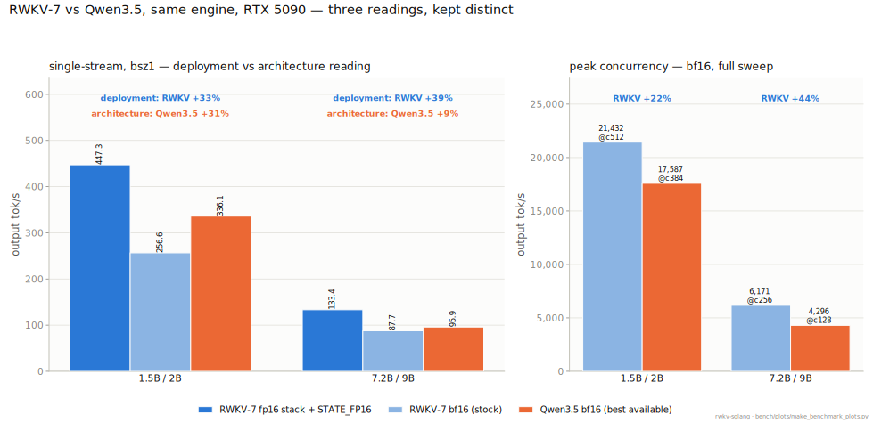

*Protocol: RTX 5090, 64-in/256-out; bsz1 = single-stream, peak = full concurrency sweep. Every
win % is recomputed in-figure from the two plotted bars. Raw: `w1prime_legEf_1.5b_5090.json`,
`w1prime_legFinal_B_7.2b_5090.json` (RWKV-7 deployment) + `qwen35/{rwkv7_1.5b,rwkv7_7.2b}_bf16_bsz1_5090.json`,
`qwen35/qwen35_{2b,9b}_bf16_bsz1_5090.json` (bf16 stock) + the matching `*_sweep_5090*.json` files
(peak). Regenerate: `python bench/plots/make_benchmark_plots.py`.*

Bonus data point: Qwen3.5 also runs natively at **FP8** (`--quantization fp8`, zero extra
code) — this is a *different* quantization tier from RWKV's int8, not a matched comparison,
but worth recording: Qwen3.5 FP8 is **25–39% slower than its own bf16 at bsz1** (206.6 vs
336.0 for 2B; 71.7 vs 96.0 for 9B) — the same small-batch quantization tax RWKV's own w8a8
shows (§4). **True int8-vs-int8 is not achievable today**: sglang's int8 path requires a
pre-quantized checkpoint with no on-the-fly quantization support, and no public
pre-quantized Qwen3.5 int8 checkpoint exists — a real, disclosed gap, not a skipped
measurement (F0048).

Raw: `bench/results/qwen35/*_5090*.json`; findings F0044–F0048.

### 13.2 Desktop tier — RTX 3090

Same protocol, tighter 24GB budget. Peak concurrency, bf16:

| tier | RWKV-7 peak | Qwen3.5 peak | winner |
|---|---:|---:|---|
| 1.5B / 2B | **7,058.6 @ c=256** | 6,316.9 @ c=384 | RWKV-7 **+11.7%** |
| 7.2B / 9B | **1,796.3 @ c=128** (confirmed flat, repeat at c=192 = 1,794.3) | 1,376.3–1,414.2 @ c=64 (memory-ceiling-terminated, still climbing) | RWKV-7 **≥+27.0%** (floor, not the true margin) |

The 7.2B/9B row is reported as a **floor**, not a final margin: three independent attempts to
push Qwen3.5-9B past c=64 on this 24GB card all failed via genuine CUDA OOM (not the
KV-starvation false-plateau this project screens for — confirmed via `nvidia-smi` headroom at
each attempt and by reverse-engineering sglang's exact memory-pool formula, which shows no
`--mem-fraction-static` value can simultaneously fund Qwen3.5-9B's mamba-cache budget and
survive a real request burst above ~c=64–68 on this card — a genuine hardware ceiling, not a
tuning gap). Qwen3.5-9B's true compute-bound peak is unreachable here; it reached 4,295.8 on
the roomier 32GB tower. Don't read "+27.0%" as the real gap — it's a conservative lower bound.

Raw: `bench/results/qwen35/*_3090*.json` (kept on the desktop box, not this repo); F0049.

### 13.3 Apple Silicon tier — MLX

Qwen3.5-2B runs on MLX **out of the box** via the standard `mlx-lm` library (0.31.3) — a real,
non-stub Metal kernel for its Gated-DeltaNet layers, not a slow fallback (F0044). Matched
multi-run comparison against RWKV-7 1.5B's MLX port, same protocol, same machine (F0045 —
full table in §12.7): **RWKV-7 wins decode** (+19.3% bf16, statistical tie at int4),
**Qwen3.5 wins prefill** (+65.6% bf16, +40.7% int4 — its dense-attention layers parallelize
over the whole prompt in a way RWKV's sequential recurrence structurally can't match).
Compression rate (matched N=40/corpus, both models): RWKV-7 1.5B fp16 **0.5926** vs
Qwen3.5-2B bf16 **0.6719** — RWKV ahead, same direction as the cloud tier's compression
finding below (F0045 addendum). **MATH500 avg@64 was not run on this platform** — a session
attempting it ran into real memory pressure on this Mac and was stopped; this is a disclosed
gap, not a silent omission. See §12.6 for why the Apple Neural Engine isn't part of this
picture either (feasibility gate FAIL, F0042).

### 13.4 Accuracy — compression rate and MATH500 avg@64 (the cloud-tier reading)

| model | precision | pooled bpb | N |
|---|---|---:|---:|
| RWKV-7 1.5B | fp16 | **0.6085** | 500/corpus (§2 canonical) |
| Qwen3.5-2B | bf16 | 0.6729 | 500/corpus, matched protocol |

**RWKV-7 1.5B compresses better than Qwen3.5-2B** despite being the smaller model — on this
ruler (one of the two this project treats as decisive, per `feedback-benchmark-rigor`),
RWKV-7 is ahead, corroborated by the same direction on the Apple Silicon tier above (two
platforms, two independent implementations, same conclusion).

**MATH500 avg@64.** An earlier run of this measurement against Qwen3.5-2B had a real
methodology bug (RWKV-tuned sampling parameters left in place for a non-RWKV model, plus no
`presence_penalty` support in the harness at all) that produced 93.15% truncation and an
unusable number; root-caused, fixed, and re-measured — see [F0053](findings/0053-qwen35-math500-sampling-fix.md)
for the full account, including the pilot-driven token-budget decision (16,384, a disclosed,
cost-bounded operating point, not each mode's asymptotic ceiling).

| model | mode | avg@64 | truncated | mean gen tokens | note |
|---|---|---:|---:|---:|---|
| RWKV-7 1.5B | fake_think (1,500 tok budget) | 40.60% (orig.) / 40.42% (current-HEAD) | 14.2% | 581 | F0024, own decreed metric |
| Qwen3.5-2B | **non-thinking** (16,384 tok budget) | **67.63%** | **0.99%** | 4,659 | **headline for this tier** — matches Qwen3.5-2B's own documented default operating mode |
| Qwen3.5-2B | thinking (16,384 tok budget) | 47.72% | 52.4% | 11,880 | reported alongside, not Qwen3.5-2B's default mode at this size; a disclosed floor, not the mode's ceiling (F0053) |
| RWKV-7 7.2B | fake_think (1,500 tok budget) | **64.18%** | 6.3% | 481 | own decreed metric, 2026-07-08 |
| Qwen3.5-9B | **non-thinking** (16,384 tok budget) | **86.28%** | **0.02%** | 1,809 | **headline for this tier** — clean convergence, matches Qwen3.5-9B's own documented default mode |
| Qwen3.5-9B | thinking (16,384 tok budget) | *not measured* | — | — | pilot showed ~13% truncated; the full run was intentionally stopped at 25% (see below) |

Raw: `bench/results/math500_avg64_7.2b_{fp16,sym,asym,hybrid_ffnvk}.json` (RWKV-7 7.2B, all
four w4 variants plus the fp16 baseline — see §4 for the full quantization write-up);
`bench/results/qwen35_accuracy/math500_avg64_2b_chatml_direct_5090.json`,
`math500_avg64_2b_chatml_thinking_5090.json` (superseded first attempt, kept for the
93%-truncation postmortem in F0053, not cited as data), `math500_avg64_2b_chatml_thinking_5090_v2.json`
(the corrected, cited run), and `math500_avg64_9b_chatml_direct_5090.json` (Qwen3.5; the 9B
thinking-mode file does not exist — the run was stopped before producing one, see below);
F0053 (the sampling-fix account) and F0024 (RWKV-7's own MATH500 protocol).

Non-thinking is reported as the headline number for both tiers specifically because
Qwen3.5's own model cards state non-thinking is the default operating mode — this
project did not pick whichever mode happens to favor either side; the model's own documented
default usage decided it. Read plainly, **Qwen3.5 beats RWKV-7 on this ruler at both tested
sizes** (2B: 67.63% vs 40.4-40.6%, a 27.2pt gap; 9B: 86.28% vs 64.18%, a 22.1pt gap) —
reported the same way a loss would be, per this project's own claims-need-numbers
discipline. The gap narrows at the larger size but stays large; both are genuine, clean,
near-zero-truncation measurements (0.99% and 0.02% respectively), not noise. Thinking mode's
truncation rate (52.4% at 2B) is disclosed plainly rather than folded into a single number
that hides it: the pilot sweep behind this number (F0053) was still rising at every token
budget tested up to 16,384, and 32,768 (Qwen3.5's own documented general-purpose default
length) was priced out on wall-clock grounds alone (a projected 16+ hours for one
measurement) — so 47.72% is a real, complete 500×64 result, but a lower bound on thinking
mode's achievable score, not its ceiling. The 9B thinking-mode row was intended to get the
same disclosed-floor treatment — its pilot showed ~13% truncated at the same 16,384 budget,
narrower than the 2B pilot's early readings — but **the full 500×64 run was deliberately
stopped at 25% (8,000/32,000 rollouts) rather than completed.** Live monitoring found
thinking-mode's long reasoning chains push per-request KV-cache residency up as the run
progresses, throttling live concurrency from ~128 down to ~22 and degrading aggregate
throughput over time (not a stall — a real, structural slowdown); the revised ETA for
completion was multiple days, on a shared GPU another project on the same box was waiting on
via this project's own newly-adopted SkyPilot scheduling discipline. Given the non-thinking
result above is already the headline number for this tier and thinking mode is explicitly
secondary, holding a shared card for days to chase it wasn't justified — the run was killed
and the card released rather than finished. This row is left honestly blank rather than
filled with a stale or extrapolated number; re-running it to completion (via `sky launch`,
per the project's own new discipline) is a legitimate future action, not a closed door.

**The complete picture requires reading this table alongside §7's peak-concurrency
throughput table, not in isolation.** On the accuracy axis measured here, Qwen3.5 leads at
both tested sizes. On peak concurrent throughput — this project's own north-star metric, see
`feedback-full-spectrum-not-single-stream` — RWKV-7 leads at both tested sizes (+21.9% at
1.5B/2B, +43.7% at 7.2B/9B, same-precision bf16 peaks). These are two different capability
axes, not a contradiction to resolve in either direction; a claim like "RWKV is faster" or
"Qwen3.5 is better" is incomplete without saying on which axis.

### 13.5 Correctness

Qwen3.5's outputs in this comparison are not just "coherent-looking" — both tested sizes are
oracle-gated against BlinkDL's own independent numpy fp32 reference implementation (the same
rigor this project always applies to its own RWKV-7 kernels). Qwen3.5-**2B**: mlx-lm (bf16)
and sglang (bf16) both agree with the reference on top-1/top-5 next-token distribution for a
probe prompt, differences consistent with ordinary bf16 rounding (F0050). Qwen3.5-**9B**: the
sglang (bf16) serving path this project's 9B numbers actually run on agrees with the same
reference — top-1 exact match, identical 10/10 top-10 token set, max absolute probability
difference 0.0049 (F0054). Getting the 9B gate to pass required a real fix, not just new
constants: 9B's linear-attention layer has an asymmetric key/query-vs-value head count (16 vs
32) that upstream's own reference script's `np.split(qkv, 3)` cannot even run against (it
requires three equal-width splits) — root-caused against HF transformers' actual
`Qwen3_5GatedDeltaNet.forward()` and fixed with a GQA-style head-expansion the 2B/0.8B tiers
never needed to exercise (both have matching key/value head counts, which is exactly why
F0050 never surfaced this). The fix was verified two ways before being trusted: algebraically
(hand-derived equivalence to HF's own reference recurrence) and empirically (the updated code,
re-run against the untouched 2B checkpoint, reproduces F0050's exact published result to 5-6
significant figures — a strict generalization, not a rewrite that happens to also work for 2B).

### 13.6 What this comparison does not yet cover (stated, not hidden)

Int8-vs-int8 (no pre-quantized Qwen3.5 checkpoint exists, §13.1). MATH500 on Apple Silicon
(memory-constrained, §13.3). A true compute-bound Qwen3.5-9B peak on 24GB hardware (memory
ceiling reached first, §13.2). Mobile and embedded device tiers (no such hardware available
to this project). None of these are being silently
skipped — each has its own tracked follow-up.

---

*In-progress (this page is updated as they land): 7.2B int4-GPTQ MATH500 avg@64 (§2/§4,
decides the w4 Stage-2 question — **resolved**: symmetric GPTQ recommended, the hybrid
ffn.value/ffn.key fix partially recovers accuracy but doesn't clear the bar over plain
symmetric, Stage 2 not warranted at 7.2B, see §4); continuing high-bandwidth-card kernel
fusion work (§7); 3090-on-main ladder; per-size decode/prefill grid vs Albatross retuned;
Qwen3.5-9B thinking-mode MATH500 avg@64 (deliberately not run to completion — see §13.4 —
released a shared GPU for another project rather than holding it for days on a secondary
metric; a legitimate re-run candidate via `sky launch`, not abandoned).*
