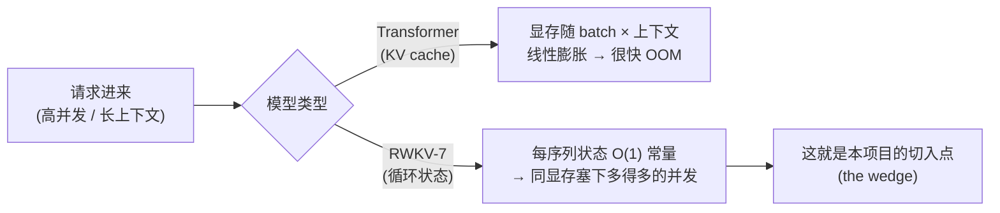
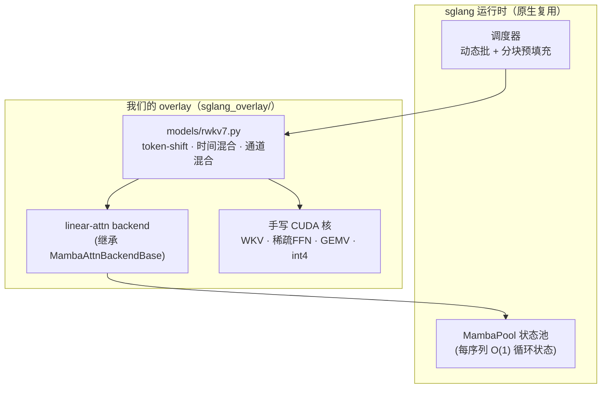
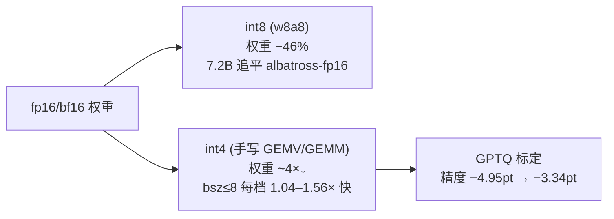

# RWKV-7 × sglang · 人类可读版文档

> 这是给**人看**的版本：由浅入深、多图多表。想看密集的工程记录（决策、证据、逐条验证），
> 去 [`../`](../)（ADR / findings / snapshot，给 agent / 深挖用）。
> 英文入口见项目根 [`README.md`](../../README.md)。

## 目录
1. [一分钟看懂](#1-一分钟看懂)
2. [为什么是 RWKV-7 × sglang](#2-为什么是-rwkv-7--sglang)
3. [整体架构](#3-整体架构)
4. [四个手写 CUDA 核](#4-四个手写-cuda-核)
5. [性能全景](#5-性能全景)
6. [量化：int8 / int4 / GPTQ](#6-量化int8--int4--gptq)
7. [快速上手](#7-快速上手)
8. [深入阅读](#8-深入阅读)

---

## 1. 一分钟看懂

把 **RWKV-7**（一个纯循环、无 attention 的大模型）接进 **sglang**（高性能推理引擎），
做到**生产可用**：数值和官方参考逐 token 对齐、可量化、能在从消费级到数据中心的各种 GPU 上跑，
并复用 sglang 原生的动态批处理、分块预填充和状态缓存。

一句话优势：



**已验证的核心成果（都能复现）：**

| 维度 | 结果 |
|---|---|
| 正确性 | 0.1B / 1.5B / 7.2B 全部**贪心逐-token 精确**（对纯 NumPy 参考） |
| 精度 | lm-eval 与 rwkv-lm **持平**（1.5B lambada 0.673 vs 0.671） |
| 服务吞吐 | 并发扩展 **~50×**（166→8298 tok/s）；显存 **O(1)** |
| 量化 | int8 追平 albatross-fp16 且省 46% 权重；手写 int4 **bsz≤8 每档快于 fp16（1.04–1.56×）**；7.2B int4 102.8 tok/s、9.8GB 可服务 |
| 覆盖 | 10 种 GPU、7 个 SM 世代（Turing→Blackwell，含 B200/RTX PRO 6000）全部跑通 |

---

## 2. 为什么是 RWKV-7 × sglang

RWKV-7 是**纯循环网络（RNN）**：处理下一个 token 时，只需要一个**固定大小的状态**，
和已经读过多少上下文**无关**。Transformer 则要把每个历史 token 的 Key/Value 都存进
KV cache，显存随上下文长度线性增长。

以 L24-D1024 规模为例：

| 模型 | 每序列状态大小 | 随上下文增长？ |
|---|---|---|
| **RWKV-7** | **1.62M（恒定）** | 否 |
| Transformer（如 Qwen3.5 的 KV） | 5.05M + 6.14×(T/1000) M | 是（线性） |

**含义**：在高并发 / 长上下文的真实 serving 里，RWKV-7 能在同样的显存里承载**多得多**的并发
序列。sglang 已经把动态批处理、分块预填充、状态缓存这套 serving 基建做得很成熟，我们把 RWKV-7
接上去，就能直接吃到这份结构性优势——这就是项目的价值锚点。（详见 [ADR-0001](../adr/0001-scope-and-wedge.md)。）

---

## 3. 整体架构

交付形态是一个**覆盖层（overlay）**：不改 sglang 源码仓库，而是把我们新增/修改的文件
`rsync` 叠加进已安装的 sglang，再照常启动即可加载 RWKV-7。



一条解码请求的路径：调度器把就绪请求组成一个 batch → RWKV-7 模型做 token-shift、时间混合
（WKV 递归）、通道混合（sqrelu FFN）→ WKV 递归**直接读写**状态池里这条序列的循环状态（O(1)）→
输出 logits。关键：**没有 KV cache，状态是常量**。（集成细节见 [ADR-0002](../adr/0002-sglang-integration-approach.md)。）

---

## 4. 四个手写 CUDA 核

RWKV-7 执行路径 **100% 不依赖 flash-linear-attention**；我们自己写了核心算子。

| 核 | 干什么 | 为什么快 | 开关 |
|---|---|---|---|
| **in-place WKV 状态 I/O** | 循环递归直接读写状态池 | 省掉 gather/scatter；WKV 是唯一随 batch 增长的解码分量 | 默认开 |
| **稀疏 sqrelu FFN** | 通道混合的 value 投影 | `relu(k)²` 实测 **86–90% 为零** → 跳过约 9/10 的权重读取（真·带宽收益） | `RWKV_SPARSE_FFN=1` |
| **融合 fp16 GEMV** | bsz1 的 r/k/v/o + key 投影 | 单流解码用手调 GEMV 替代 cuBLAS | `RWKV_FAST_LINEAR=1` |
| **weight-only int4 GEMV** | 4-bit 权重的解码 | 读 int4 权重 = fp16 的 1/4 字节；解码是带宽瓶颈 → 更快 | `RWKV_W4=1` |

全部满足：**贪心逐-token 精确、批不变、cuda-graph 安全、IEEE 数值**（不开 fast-math）。
设计与证据见 [`../design/m6-sparse-ffn.md`](../design/m6-sparse-ffn.md) 和 findings F0015–F0017。

---

## 5. 性能全景

> 对标 albatross 的数字在独占 RTX 3090 上干净测量、可复现；跨卡数字为各卡真机实测。

### 5.1 并发吞吐——填满 batch 可扩展 ~50×（1.5B）
| 并发 bsz | 解码 tok/s | 峰值显存 (MiB) |
|---|---|---|
| 1 | 166 | 12,420 |
| 64 | 6,445 | 12,622 |
| 128 | **8,298** | 12,622 |
| 256 | 8,187 | 12,622 |

→ 吞吐涨 ~50×，256 并发 vs 1 并发显存只 **+202 MiB**（状态是常量）。

### 5.2 上下文不变性——显存和每-token 解码成本不随上下文涨（1.5B, bsz8）
| 上下文 | 每-token 解码 (ms) | 峰值显存 (MiB) |
|---|---|---|
| 1K | 7.7 | 12,364 |
| 16K | 10.7 | 12,364 |
| 64K | 7.4 | 12,368 |

→ 上下文放大 **64×**，显存只 **+4 MiB**。KV-cache 模型在这里早就 OOM 了。

### 5.3 同精度单流裸解码 vs albatross（诚实短板）
这是 albatross 的主场（纯单流 mega-kernel，逼近显存带宽上限）；我们是完整服务引擎，仍如实公布：

| 模型 | bsz1 | bsz8 | bsz32 |
|---|---|---|---|
| 7.2B | 0.83× | 0.84× | 0.72× |
| 1.5B | 0.66× | **0.90×** | 0.70× |

→ 靠三个手写核，中/大模型在同精度单流轴上达到 **0.66–0.90×**。

### 5.4 真实负载（ShareGPT 变长请求，标准 bench_serving，1.5B）
| 请求速率 | 输出 tok/s | 总 tok/s | 中位 TTFT |
|---|---|---|---|
| 峰值 | 1,275 | 3,361 | 7.2 s |
| 16 req/s | 1,025 | 2,702 | **273 ms** |

### 5.5 全 GPU 系列（10 种 GPU、Turing→Blackwell，1.5B）
| GPU | 架构 | bf16 贪心精确 | bf16 解码 b1/b8/b32 | int4 解码 b1（vs bf16） |
|---|---|---|---|---|
| T4 | Turing | ✅ 24/24 | 65 / 446 / 592 | 115（**1.77×**） |
| L4 | Ada | ✅ 24/24 | 76 / 521 / 737 | 155（**2.04×**） |
| A10G | Ampere | ✅ 24/24 | 105 / 767 / 986 | 198（**1.88×**） |
| A100-80G | Ampere | ✅ 24/24 | 166 / 1341 / 4417 | 205（1.23×） |
| L40S | Ada | ✅ 24/24 | 171 / 1090 / 4150 | 288（**1.68×**） |
| H100 | Hopper | ✅ 24/24 | 230 / 1788 / 6569 | 261（1.14×） |
| H200 | Hopper | ✅ 24/24 | 242 / 1875 / 6938 | 263（1.09×） |
| **B200** | Blackwell 10.0 | ✅ 24/24 | 217 / 1801 / **7213** | 249（1.14×） |
| **RTX PRO 6000** | Blackwell 12.0 | ✅ 24/24 | 201 / 1167 / 5469 | 284（**1.41×**） |

→ bf16 全 10 卡、7 个 SM 世代精确；int4 全 10 卡可跑且 bsz1 更快（Turing→Blackwell 通吃）。
完整网格（含 A100-40G + 预填充 + int8）见 [`../../bench/results/multigpu.md`](../../bench/results/multigpu.md)。

---

## 6. 量化：int8 / int4 / GPTQ



int4 的精度对比（lambada full 5153）：

| 方案 | acc | 相对 bf16 |
|---|---|---|
| bf16 基线 | 0.6724 | — |
| int8 | 0.6509 | −2.15 |
| **int4 GPTQ** | **0.6390** | **−3.34** |
| int4 RTN（免标定） | 0.6229 | −4.95 |

→ GPTQ（激活感知标定）把 int4 精度拉到距 int8 约 1.2pt，且产出同格式、手写核不变。
详见 [`../findings/0017-w4-int4-quant.md`](../findings/0017-w4-int4-quant.md)。

---

## 7. 快速上手

```bash
# 1. 把 overlay 叠加进已安装的 sglang（rsync，不编译）
BOX=<host> SP=<sglang-site-packages> bash scripts/deploy.sh

# 2. 转换 BlinkDL .pth → sglang 可加载的权重
python tools/convert_rwkv7_blinkdl_to_fla.py --pth <rwkv7.pth> --out <model_dir>

# 3. 照常启动 sglang（RWKV-7 会自动被识别，radix cache 自动关闭以保证 RNN 正确性）
python -m sglang.launch_server --model-path <model_dir> --dtype bfloat16 --disable-radix-cache

# 可选：开手写核 / 量化
RWKV_SPARSE_FFN=1 RWKV_FAST_LINEAR=1 ...   # bsz1 加速
RWKV_W4=1 ...（配合 int4 checkpoint）        # 4-bit：省显存 + bsz≤8 更快
```

---

## 8. 深入阅读

| 想看 | 去哪 |
|---|---|
| 当前权威状态 | [`../snapshot.md`](../snapshot.md) |
| 架构决策（为什么这么做） | [`../adr/`](../adr/) |
| 逐条实验证据 | [`../findings/`](../findings/) |
| 手写核设计 | [`../design/m6-sparse-ffn.md`](../design/m6-sparse-ffn.md) |
| 所有基准原始数据 | [`../../bench/results/`](../../bench/results/) |
